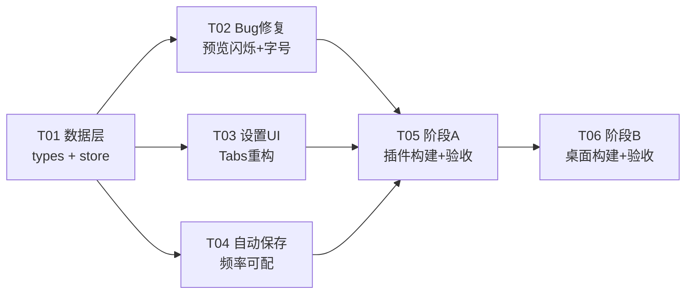

# 架构评审与任务分解：v0.2.x 迭代（3 功能 + 2 Bug）

**评审人**：高见远（Architect）
**日期**：2026-08-10
**评审对象**：`deliverables/product-strategy/prd-v0.2.x-iterate-2026-08-08.md`
**代码基线**：桌面版 v0.4.1 / 插件版 v0.2.0（同仓库双产物线，共享 `src/`）

---

## 一、可行性结论

### 结论：**GO with conditions**

改动全部落在共享 `src/` 的 7 个文件内，无 Rust 侧改动、无新增依赖、无数据结构破坏性变更。工程量小、风险可控。

**但 PRD 中 Bug 5 与 Bug 6 的根因诊断均与实际代码不符**，若工程师照 PRD 原文实现，Bug 6 修不好（闪烁依旧）、Bug 5 修错方向（真正不跟随的元素没被覆盖）。**放行条件是先按本文第四节修正这两条的技术方案。**

### 关键风险点

| # | 风险 | 等级 | 说明 |
|---|------|------|------|
| R1 | **Bug 6 按 PRD 实现无效** | 🔴 高 | 闪烁真因是 `isPreviewLoading` 早返回整体换 DOM，不是 `dangerouslySetInnerHTML`。只换 innerHTML 不动早返回 = 白干 |
| R2 | **Bug 5 按 PRD 实现修错对象** | 🟠 中 | `--editor-font-size` 链路完好、正文确实会变；真正不跟随的是代码块/表格（硬编码 13.5px） |
| R3 | **5s 自动保存 × inline 桥接 15s 超时** | 🟠 中 | inline 模式静默保存超时 15s，间隔 5s 会产生请求叠加/堆积 |
| R4 | **`autoSaveEnabled` 与 `autoSaveInterval` 双状态源** | 🟠 中 | 前者在 store 非持久化，后者要进持久化 `EditorSettings`，双向联动易出不一致 |
| R5 | **版本号口径未定** | 🟡 低 | PRD 标题 v0.2.x 与实际 0.4.1/0.2.0 冲突；且桌面是否本轮发版未定 |
| R6 | 双屏互换后编辑器分隔线位置错误 | 🟡 低 | `.editor-wrapper` 硬编码 `border-right`，反转后会跑到最外侧 |

### 加分项（低成本顺带修掉）

代码里有两个**既存潜伏 bug**，本轮改 PreviewPane 时可零成本一并解决：

- `PreviewPane` 的 scroll 监听 `useEffect(..., [])` 在挂载时若 `isPreviewLoading===true`，`containerRef.current` 为 `null`，**监听器永远不会挂上**，滚动位置记录失效。
- `PreviewPane` 用 `useAppStore()` **无 selector 全量订阅**，任意 store 变更（含每次按键的 `setSavedScrollTop`）都触发重渲染。

---

## 二、版本号 bump 建议

### 现状核实（已逐一 Read 确认）

| 产物线 | 位置 | 当前值 |
|--------|------|--------|
| 桌面版 | `package.json:3` | `0.4.1` |
| 桌面版 | `src-tauri/tauri.conf.json:4` | `0.4.1` |
| 桌面版 | `src-tauri/Cargo.toml:3` | `0.4.1` |
| 桌面版 | `src/components/AboutDialog.tsx:6` | `0.4.1`（三元右支） |
| 插件版 | `manifest.json:4` | `0.2.0` |
| 插件版 | `src/components/AboutDialog.tsx:6` | `0.2.0`（三元左支） |

> 注：主理人提到的 `build_dmg.py` 在当前仓库不存在（`scripts/` 下只有 `build-content.mjs` / `package-extension.sh` / `verify-extension.mjs`），桌面版本号实际只有 **4 处**。`AboutDialog.tsx:6` 一行同时承载双线版本号：
> `const CURRENT_VERSION = isExtension ? '0.2.0' : '0.4.1';`

### 建议

**本轮交付 3 个新增用户可见功能 + 2 个 bug 修复，语义化版本应走 minor，不是 patch。**

| 产物线 | 建议 | 依据 |
|--------|------|------|
| **插件版** | `0.2.0` → **`0.3.0`** | 3 个新功能（双屏互换/自动保存频率/设置 Tabs）属 feature 级，minor bump |
| **桌面版** | `0.4.1` → **`0.5.0`** | 同一批共享代码落到桌面端，用户可见能力等同，同步走 minor |

**同时建议把 PRD 标题从「v0.2.x」改为「插件 v0.3.0 / 桌面 v0.5.0」**，消除文档与代码的口径冲突。PRD 里写的「v0.2.0 ~ v0.2.3」是把插件版号当成了全局版号，属文档笔误。

**⚠️ 注意 PRD 自相矛盾**：Non-goals 写「不修改桌面版 Tauri 端任何逻辑」，但桌面 bump 必然要改 `tauri.conf.json` + `Cargo.toml`。这两者是**配置**不是**逻辑**，不冲突，但需要在 PRD 里说清。

**若桌面本轮不发版**（见第六节待明确事项 Q1），则桌面 4 处版本号一律不动，只 bump 插件版到 0.3.0，桌面留到下次统一发。

---

## 三、两阶段执行计划（先插件、后桌面）

### 3.1 为什么不能做代码隔离

所有 7 个改动文件都在共享 `src/` 内，`isExtension` 只在**运行时/编译期切后端**（文件 I/O、剪贴板、事件源），**不切 UI 与业务逻辑**。这 5 项改动没有一项需要平台分支，因此**物理上不存在「只给插件版实现」的做法**。

用户要的「先插件后桌面」应理解为**验收节奏**而非**开发节奏**：

```
共享代码一次性实现（不分产物线）
        │
        ├─ 阶段 A：build:ext → 插件真机点测 → 通过则发插件 v0.3.0
        │
        └─ 阶段 B：tauri:build → 桌面真机点测 → 通过则发桌面 v0.5.0
```

阶段 B **不再改共享代码**（除非阶段 A/B 发现缺陷）。这样既满足用户的先后顺序诉求，又避免同一功能写两遍。

### 3.2 插件版两种运行模式的差异（重点）

插件版有两种形态，本轮改动在两者下的表现**不完全一致**，验证必须双跑：

| 维度 | ① file:// 内嵌 iframe（inline） | ② 独立 editor.html 标签页 |
|------|--------------------------------|--------------------------|
| 触发方式 | 浏览器打开本地 `.md`，content script 清空 body 注入全屏 iframe | 点扩展图标 / `Cmd+Shift+M` / New·Open 开新标签 |
| `isIframe` | `true` | `false` |
| 视口 | `position:fixed; inset:0` 全屏，**与独立标签页等尺寸** | 整个标签页 |
| **打开后默认 viewMode** | `preview`（`openFileByContent` 强制） | `preview`（同）／新建文档为 `split` |
| **双屏互换** | 无差异（纯 CSS `flex-direction`）；**但需先手动切到 split 才可见** | 同左 |
| **预览防闪烁** | 无差异（同一份 React 组件、同一渲染路径） | 同左 |
| **自动保存** | ⚠️ **差异最大**：走 `saveInlineToOriginal` postMessage 桥接父页面直写，`silentOnly=true`，**超时 15s** | 走 `writeFile(handle)` 直接 FSAA 写盘，无桥接、无超时 |
| **设置持久化** | `chrome.storage.local`（chrome-extension:// origin） | 同左 —— **两种模式共享同一份设置** |

**关键结论**：
1. **设置是跨模式共享的**，在独立标签页改了设置，inline 模式下次打开即生效 —— 验证时要交叉验一次。
2. **自动保存频率的风险只存在于 inline 模式**（见 R3）：间隔 5s、桥接超时 15s，若父页面未授权或响应慢，会出现多条静默保存请求在途重叠。虽然 `saveInlineToOriginal` 有 `requestId` 关联防串味、`isInteractiveInlineSaveInFlight()` 防并发，但**从未在 5s 级间隔下验证过**。
3. **双屏互换在两种模式下都要先手动切 split**，因为打开文件默认落 `preview`。点测清单必须显式写这一步，否则测试者会以为功能没生效。

### 3.3 阶段 A：插件版（v0.3.0）

**构建**：`npm run build:ext` → `npm run verify:ext` → 加载 `dist-extension/`

**真机点测覆盖矩阵**（两种模式各跑一遍）：

| 用例 | inline | 独立标签 |
|------|:------:|:--------:|
| A1 设置弹窗 4 个 tab 切换、内容不串、无滚动条 | ✅ | ✅ |
| A2 Editor tab 改字号 → 编辑器 + 预览正文/标题**同步变化** | ✅ | ✅ |
| A3 Preview tab 改预览字号 → 仅预览变，编辑器不变 | ✅ | ✅ |
| A4 代码块 / 表格字号跟随预览字号变化（Bug 5 真修点） | ✅ | ✅ |
| A5 切 split → 互换为 editor-right → 编辑器在右、预览在左、**分隔线在中间** | ✅ | ✅ |
| A6 互换后 TOC 点击跳转、编辑→预览同步滚动仍正常 | ✅ | ✅ |
| A7 split 下连续快速打字 → **预览区无「Rendering…」闪白**、滚动位置不跳 | ✅ | ✅ |
| A8 自动保存设 5s → 观察 5s 落盘；设「不自动保存」→ 不落盘 | ⚠️ 重点 | ✅ |
| A9 StatusBar 文案随设置变化（`Auto-save (5s)` / `(OFF)`）、勾选框联动 | ✅ | ✅ |
| A10 改设置 → 关标签页重开 → 设置保留 | ✅ | ✅ |
| A11 Reset Defaults → 4 个 tab 全部回默认 | ✅ | ✅ |
| A12 **老用户升级**：保留旧 `mdnote-settings`（无新字段）→ 不崩、新字段取默认 | ✅ | ✅ |

> A8 在 inline 模式为重点：需验证 5s 间隔下**未授权**（不弹遮罩、不刷 error）与**已授权**（静默落盘、无重复写）两种情况。

### 3.4 阶段 B：桌面版（v0.5.0）

**前置**：阶段 A 全绿且插件已发。
**构建**：`npm run tauri:build`

桌面版走的是 `performDesktopSave` → `invoke('write_file')`，无桥接、无超时，自动保存风险显著低于 inline。桌面重点复验：

| 用例 |
|------|
| B1 A1–A7、A9–A12 全量重跑（桌面窗口环境） |
| B2 自动保存 5s / 30s / OFF → Tauri 写盘正确、无文件锁冲突 |
| B3 多窗口：窗口 1 改设置 → 窗口 2 **不会**实时同步（localStorage 无跨窗口广播）→ 确认是否可接受 |
| B4 About 弹窗版本号显示 0.5.0 |
| B5 双屏互换后 macOS 原生 Edit 菜单（复制/粘贴/撤销）仍作用于编辑器 |

> **B3 是新发现的桌面独有问题**：设置存 localStorage，桌面多窗口场景下 A 窗口改设置不会通知 B 窗口。这是**既存行为**（不是本轮引入），但本轮把设置项从 3 个扩到 7 个后会更容易被用户察觉。建议记录为已知问题，不在本轮修。

---

## 四、Bug 5 / Bug 6 真实根因与修复方案（PRD 诊断均需修正）

### 4.1 Bug 5：预览区字体不跟随设置

#### PRD 的说法

> 「`.preview-pane` 也正确引用了 `var(--editor-font-size)`……预览区是比例字体，视觉效果与等宽的编辑器不同，用户可能认为『没变化』」

#### 实际代码核实

逐环节验证 CSS 变量链路：

| 环节 | 实际情况 | 结论 |
|------|----------|------|
| `applySettingsToCSS` 是否设置变量 | `App.tsx:171` `root.style.setProperty('--editor-font-size', ...)` 写在 `<html>` 内联样式 | ✅ 有 |
| `.preview-pane` 是否引用 | `globals.css:333` `font-size: var(--editor-font-size, 15px)` | ✅ 有 |
| 是否被其他规则覆盖 | 全文件搜 `--editor-font-size` 仅 2 处（`:root` 定义 + `.preview-pane` 引用）；`.preview-pane` 的 font-size 无任何 `!important` 覆盖 | ✅ 无覆盖 |
| 选择器优先级 | 无竞争规则 | ✅ 无问题 |

**→ 链路完好。正文 `<p>`、`<li>`、标题（`em` 相对单位）确实会跟随编辑器字号变化。**

> 顺带说明：`globals.css:7-10` 有一段注释，记录了历史上**已经修过一次**这个问题（裸 `[data-theme='light']` 选择器把 `--editor-*` 盖回默认值）。当前代码是修好的状态。

#### 真正的根因：**局部不跟随，不是全局不跟随**

预览区里有三类元素**硬编码了 px，不随设置缩放**：

| 位置 | 规则 | 后果 |
|------|------|------|
| `globals.css:957` | `.preview-pane pre { font-size: 13.5px }` | **代码块永远 13.5px** |
| `globals.css:965` | `.preview-pane code { font-size: 0.88em }` | `pre` 内的 code = 0.88 × 13.5px，**同样固定** |
| `globals.css:1038` | `.preview-pane table { font-size: 13.5px }` | **表格永远 13.5px** |

如果用户拿一篇代码块 / 表格密集的文档（对 Markdown 编辑器是典型场景）去拖字号滑块，看到的就是「大半篇幅纹丝不动」→ 报「预览区字体不跟随设置」。**这是可复现的真 bug，只是范围比 PRD 描述的窄且具体。**

#### 另一处 PRD 事实性错误

PRD 称「预览区正文使用衬线/无衬线字体」「预览区是比例字体」。实际 `globals.css:332`：

```css
.preview-pane {
  font-family: var(--editor-font-family, -apple-system, ...);
}
```

**预览区用的是和编辑器完全相同的等宽字体（默认 SF Mono）**，不是比例字体。PRD 的整个推理前提不成立。

#### 修复方案（修正版）

分两层，**必做 + 建议做**：

**① 必做 —— 让硬编码 px 改为相对单位**（真正解决用户反馈）

```css
.preview-pane pre   { font-size: 0.95em; }   /* 原 13.5px */
.preview-pane table { font-size: 0.95em; }   /* 原 13.5px */
/* .preview-pane code 的 0.88em 保持不变，自动跟随父级 */
```

**② 必做 —— 预览字号独立设置**（PRD 的产品诉求本身合理，保留）

```ts
// types/index.ts
previewFontSize: number;   // 默认 14（与编辑器默认字号一致）
```
```ts
// App.tsx applySettingsToCSS
root.style.setProperty('--preview-font-size', `${settings.previewFontSize}px`);
```
```css
/* globals.css:333 —— 带回退，老配置无该字段时不塌 */
.preview-pane { font-size: var(--preview-font-size, var(--editor-font-size, 15px)); }
```

**③ 建议做 —— 预览字体族也独立**（否则「预览用等宽字体」这个更扎眼的问题仍在）

```ts
previewFontFamily: string;  // 默认 '-apple-system'（比例字体）
```

> ③ 是新增需求，超出 PRD 范围，**需产品确认**（见 Q4）。若不做，预览区将继续以 SF Mono 渲染正文，与 PRD 里「预览区正文使用衬线/无衬线字体」的描述不符。

---

### 4.2 Bug 6：双屏编辑预览区闪烁

#### PRD 的说法

> 「`dangerouslySetInnerHTML` 全量替换 DOM：React 卸载旧 HTML → 预览区先清空 → 再挂载新 HTML……清空瞬间用户看到空白」

#### 实际代码核实 —— **诊断错误**

两点事实：

1. **React 的 `dangerouslySetInnerHTML` 不会「先清空再填充」。** 提交阶段就是一次 `node.innerHTML = html` 原子赋值；且 `__html` 字符串不变时 React **完全跳过**写入。它不是闪烁源。

2. **真正的闪烁源是 `isPreviewLoading` 触发的整棵子树替换。** 完整链路：

```
用户按键
  → EditorPane updateListener → setContent
  → App.handleContentChange → setSavedScrollTop()        ← 每次按键都写 store
  → 150ms 防抖 → useFileOps.updatePreview()
      → setIsPreviewLoading(true)                        ← ★ 罪魁祸首
          → PreviewPane 重渲染，命中早返回：
              return <div className="preview-pane loading">
                       <span class="loading-spinner"/> Rendering...
                     </div>
            ★★ 整个预览内容 DOM 被卸载，换成一个居中的 spinner ★★
      → worker 渲染完成 → setHtmlPreview(html)（内部同时 isPreviewLoading:false）
          → PreviewPane 重渲染 → 挂载**全新的** <div ref={containerRef}>
            ★★ 新 DOM 节点，scrollTop 归零 ★★
      → requestAnimationFrame(() => el.scrollTop = savedScroll)   ← 事后补丁
```

`PreviewPane.tsx:257-266` 的早返回把 `.preview-pane` 换成了 `.preview-pane.loading`（`display:flex` + 居中 + 斜体灰字）。**打字时每 150ms 就闪一次「Rendering…」再闪回内容 —— 这就是用户看到的一闪一闪。**

`useFileOps.ts:556-560` 那段 `requestAnimationFrame` 补 scrollTop，本身就是在给「DOM 被换掉、滚动位置丢失」打补丁 —— 反过来印证了根因。

**→ 若工程师只照 PRD 换 `innerHTML` 而不动早返回，闪烁一点不会改善。**

#### 关于「直接 innerHTML 是否丢失后处理」

已逐项核对 `PreviewPane.tsx`，**结论：不会丢失任何东西**：

| 后处理 | 实现位置 | 是否受 innerHTML 赋值影响 |
|--------|----------|--------------------------|
| **hljs 代码高亮** | `src/workers/md-worker.ts`（worker 内 markdown-it + hljs），**已烘焙进 HTML 字符串** | ❌ 不受影响 |
| **图片路径转换** | `processImageUrls()`，纯字符串 replace，在 `useMemo` 内 | ❌ 不受影响 |
| **XSS 过滤** | `sanitizeHtml()`，纯字符串变换 | ❌ 不受影响 |
| **TOC 锚点跳转** | `window` 事件 + 触发时 `containerRef.current.querySelector('[data-source-line]')` | ❌ 惰性查询，不绑节点 |
| **编辑→预览同步滚动** | 同上，`window` 事件 + 惰性 querySelectorAll | ❌ 不受影响 |
| **查找结果跳转** | 同上 | ❌ 不受影响 |
| **图片/链接灯箱** | **代码中不存在**（PRD 与主理人的担心是多余的） | — |
| **hljs 主题 CSS 切换** | 动态 `<link>` 挂 `document.head` | ❌ 与预览 DOM 无关 |
| 容器 scroll 监听 | 唯一绑在容器节点上的监听 | ⚠️ 见下 |

唯一需要注意的是容器上的 `scroll` 监听。**只要容器节点保持稳定不被卸载，它反而比现在更安全** —— 现状下容器每次都被换掉，监听器实际是失效的（见 4.3）。

#### 修复方案（修正版，按优先级）

**① P0 核心 —— 容器节点恒定，loading/empty 改为覆盖层**

```tsx
// PreviewPane.tsx —— 去掉两个早返回，容器永不卸载
return (
  <div className={`preview-pane ${theme}`} style={{ position: 'relative' }}>
    <div ref={containerRef} className="preview-content" />
    {showFirstLoad && <div className="preview-overlay">…Rendering</div>}
    {isEmpty && <div className="preview-overlay">Start typing…</div>}
  </div>
);
```

> 注意：`containerRef` 要挂在**内层专用节点**上，因为该节点的 children 完全由 innerHTML 接管，不能再放任何 JSX 子元素（否则 React 与手动 DOM 写入互相踩踏）。滚动容器与 innerHTML 容器建议分离：`.preview-pane` 负责 `overflow-y:auto`，`.preview-content` 只负责承载 HTML。**这会牵动 `globals.css` 中大量 `.preview-pane xxx` 后代选择器 —— 因为是后代选择器（不是子选择器），多一层 `.preview-content` 不会失效，无需批量改。**

**② P0 —— 内容更新路径不再置 loading**

```ts
// useFileOps.updatePreview：删除 setIsPreviewLoading(true)
// 仅在 openFile / openFileByContent（首次加载）保留
```

**③ P1 —— 手动 innerHTML + 保滚动位置**

```tsx
useLayoutEffect(() => {
  const el = containerRef.current;
  if (!el || el.innerHTML === processedHtml) return;   // 内容没变就不写
  const scroller = el.parentElement!;
  const prev = scroller.scrollTop;
  el.innerHTML = processedHtml;
  scroller.scrollTop = prev;                            // 同步恢复，绘制前完成
}, [processedHtml]);
```

用 `useLayoutEffect` 而非 `useEffect`：写入与滚动恢复都在浏览器绘制前完成，**用户看不到任何中间态**。

**④ P1 —— 拆掉两处滚动补丁**

`useFileOps.ts` 的 `requestAnimationFrame` scrollTop 补丁、`PreviewPane` 中依赖 `savedScrollTop` 的 `useLayoutEffect` 都可以移除 —— ③ 已在正确时机保住滚动位置。保留会与 ③ 打架产生抖动。

**⑤ P1 —— PreviewPane 改用 selector 订阅**

```ts
const htmlPreview = useAppStore(s => s.htmlPreview);
const theme       = useAppStore(s => s.theme);
// …逐个订阅，替代 const {...} = useAppStore()
```

现状全量订阅导致每次按键（`setSavedScrollTop`）都重渲染 PreviewPane。

**⑥ 关于 PRD 的「150ms → 400ms 防抖」**

修完 ①②③ 后，闪烁的根因已消除，**不建议再把防抖拉到 400ms** —— 那会让预览明显「跟不上手」，用体验换一个已经不存在的问题。建议**维持 150ms**，真机点测若仍觉卡再调到 200–250ms。

> 另注：`lib/constants.ts:16` 已定义 `PREVIEW_DEBOUNCE = 100`，但 `App.tsx:613` 硬编码了 `150` —— 常量根本没被引用。本轮顺手统一到常量，避免下次又有人改错地方。

---

### 4.3 顺带修掉的既存缺陷（零成本）

| 缺陷 | 现状 | ①之后 |
|------|------|-------|
| scroll 监听挂不上 | `useEffect(..., [])` 在挂载时若 `isPreviewLoading===true`，`containerRef.current` 为 null，`scrollPosRef` 永远不更新 | 容器恒定 → 自动修复 |
| 每次按键重渲染 PreviewPane | 全量订阅 store | ⑤ 修复 |
| 滚动位置双重设置打架 | rAF 补丁 + `savedScrollTop` useLayoutEffect | ④ 修复 |

---

## 五、双屏互换技术评估

### DOM 结构核实

`viewMode='split'` 时（`App.tsx:647-664`）：

```html
<main class="editor-preview-container">   <!-- display:flex -->
  <div class="pane editor-wrapper">  ...  <!-- flex:1 -->
  <div class="pane preview-wrapper"> ...  <!-- flex:1 -->
</main>
```

`globals.css` 中 **`data-view-mode` 没有任何 CSS 规则**（已全文搜索确认），三种 viewMode 完全靠 React 条件渲染控制挂载与否，不靠 CSS 隐藏。

### 结论：`flex-direction: row-reverse` 足够 ✅

- 两个 pane 都是 `flex: 1`，等宽，反转后布局对称，无副作用。
- **同步滚动确实不受影响**：`editor:scroll-preview` / `preview:scroll-to-heading` 等全部走 `window` 自定义事件 + `data-source-line` 惰性查询，**与 DOM 顺序完全无关**。PRD 这条判断正确。
- WelcomeScreen 也是该容器的子元素，但欢迎态只有一个子节点，反转无影响。

### ⚠️ 一处 PRD 漏掉的细节：分隔线

```css
.editor-wrapper  { border-right: 1px solid var(--mf-border); }  /* globals.css:311 */
.preview-wrapper { border-left: none; }                          /* globals.css:315 */
```

反转后编辑器跑到右侧，它的 `border-right` 会贴在**窗口最右缘**，而中间两个 pane 之间**没有分隔线**。必须补：

```css
.editor-preview-container.split-reversed { flex-direction: row-reverse; }
.split-reversed .editor-wrapper  { border-right: none; border-left: 1px solid var(--mf-border); }
```

**实现建议**：用 class 而非内联 style（PRD 的「App.tsx 中设置 flex 方向」），因为分隔线也要一起切换，内联 style 处理不了。

---

## 六、任务分解（有序，含依赖与阶段归属）

### 依赖关系图



### 任务清单

| ID | 任务 | 阶段 | 优先级 | 依赖 | 改动文件 |
|----|------|------|:------:|------|----------|
| **T01** | 数据层：新增设置字段 | 共享 | P0 | — | `types/index.ts`、`lib/constants.ts` |
| **T02** | Bug 修复：预览闪烁 + 字号跟随 | 共享 | P0 | T01 | `components/PreviewPane.tsx`、`hooks/useFileOps.ts`、`App.tsx`、`styles/globals.css` |
| **T03** | 设置弹窗 Tabs 重构 + 双屏互换 | 共享 | P1 | T01 | `components/SettingsDialog.tsx`、`App.tsx`、`styles/globals.css` |
| **T04** | 自动保存频率可配 | 共享 | P1 | T01 | `hooks/useAutoSave.ts`、`components/StatusBar.tsx`、`store/useAppStore.ts` |
| **T05** | 阶段 A：插件 v0.3.0 构建 + 真机验收 | **插件** | P0 | T02,T03,T04 | `manifest.json`、`components/AboutDialog.tsx` |
| **T06** | 阶段 B：桌面 v0.5.0 构建 + 真机验收 | **桌面** | P1 | T05 | `package.json`、`src-tauri/tauri.conf.json`、`src-tauri/Cargo.toml`、`components/AboutDialog.tsx` |

---

### T01 · 数据层：新增设置字段（P0，无依赖）

**文件**：`src/types/index.ts`、`src/lib/constants.ts`

```ts
export interface EditorSettings {
  // …既有 10 个字段不动…
  splitLayout: 'editor-left' | 'editor-right';  // 默认 'editor-left'
  autoSaveInterval: number;                      // 毫秒，0 = 关闭，默认 60000
  previewFontSize: number;                       // px，默认 14（与编辑器默认字号一致）
  // previewFontFamily?: string;                 // 待 Q4 确认后决定是否加
}
```

**要点**：
- `DEFAULT_EDITOR_SETTINGS` 同步补三个默认值。
- **无需写迁移逻辑**：`useAppStore.ts:128` 与 `:346` 都是 `{ ...DEFAULT_EDITOR_SETTINGS, ...parsed }`，老配置缺字段自动取默认。**已核实，向前兼容安全。**
- `constants.ts` 补 `AUTO_SAVE_INTERVAL_OPTIONS` 选项表；`AUTO_SAVE_INTERVAL = 60_000` 保留为默认值引用。
- 顺手把 `PREVIEW_DEBOUNCE` 真正用起来（现被 `App.tsx:613` 硬编码 150 架空）。

---

### T02 · Bug 修复：预览闪烁 + 字号跟随（P0，依赖 T01）

**文件**：`PreviewPane.tsx`、`useFileOps.ts`、`App.tsx`、`globals.css`

按 §4.1 与 §4.2 的**修正方案**实施，逐条：

1. `PreviewPane.tsx`：去掉两处早返回 → 恒定容器 + `.preview-content` 内层 + 覆盖层
2. `PreviewPane.tsx`：`useLayoutEffect` 手动 `innerHTML` + 前后保 scrollTop + 内容相同时跳过
3. `PreviewPane.tsx`：全量 `useAppStore()` 改为逐项 selector
4. `PreviewPane.tsx`：移除依赖 `savedScrollTop` 的 useLayoutEffect
5. `useFileOps.ts`：`updatePreview` 删 `setIsPreviewLoading(true)` 与 rAF 滚动补丁；首次打开路径保留 loading
6. `App.tsx`：`applySettingsToCSS` 增 `--preview-font-size`
7. `globals.css`：`.preview-pane` font-size 改 `var(--preview-font-size, var(--editor-font-size, 15px))`
8. `globals.css`：`pre` / `table` 的 `13.5px` → `0.95em`（**Bug 5 真修点**）
9. `globals.css`：新增 `.preview-content` / `.preview-overlay` 样式

**验收**：split 下连续打字，预览区无「Rendering…」闪现、滚动不跳；代码块/表格字号随设置变化。

---

### T03 · 设置弹窗 Tabs 重构 + 双屏互换（P1，依赖 T01）

**文件**：`SettingsDialog.tsx`（大改）、`App.tsx`、`globals.css`

**Tab 划分**（对齐 PRD，含新增项）：

| Tab | 内容 |
|-----|------|
| Editor | Font / Font Size / Line Height / Code Theme / Follow System Theme |
| Preview | **Preview Font Size（新）** / Paragraph Spacing |
| Behavior | Indent / Word Wrap / Line Numbers / **Split Layout（新）** |
| Auto-Save | **Auto-Save Interval（新）** |

**要点**：
- 弹窗宽度 480 → 520px；`useState<TabKey>('editor')`；4 个 tab 高度取齐避免切换跳动。
- **无障碍**：tab 导航用 `role="tablist"` / `role="tab"` / `aria-selected`，支持左右方向键。
- Reset Defaults 语义不变（`resetSettings()` 已整体重置，天然覆盖全部 tab）。
- `App.tsx`：`<main className={'editor-preview-container' + (settings.splitLayout === 'editor-right' ? ' split-reversed' : '')}>`
- `globals.css`：`.split-reversed { flex-direction: row-reverse }` + **分隔线换边**（§5 的坑）+ tab 导航样式。
- 不引入第三方 UI 库（遵守 PRD Non-goal）。

---

### T04 · 自动保存频率可配（P1，依赖 T01）

**文件**：`useAutoSave.ts`、`StatusBar.tsx`、`useAppStore.ts`

**⚠️ 核心设计决策 —— 消除双状态源（R4）**

现状 `autoSaveEnabled` 是 store 里的**非持久化** boolean（`useAppStore.ts:228`，每次启动都回 `true`），而 `autoSaveInterval` 要进**持久化**的 `EditorSettings`。两者若各存各的，必然出现「设置里选了 OFF、重启后勾选框又自己勾上」这类不一致。

**建议：以 `settings.autoSaveInterval` 为唯一真源，`autoSaveEnabled` 降级为派生值。**

```ts
// 派生，不再独立存储
const autoSaveEnabled = settings.autoSaveInterval > 0;

// StatusBar 勾选框 onChange：
//   取消勾选 → updateSettings({ autoSaveInterval: 0 })
//   勾选     → updateSettings({ autoSaveInterval: lastNonZero ?? 60000 })
```

这样天然满足 PRD 的「设置↔勾选框双向联动」，且顺带让自动保存开关**变成持久化的**（现状重启即丢，本身也是个小缺陷）。
`store` 中 `autoSaveEnabled` / `setAutoSaveEnabled` 建议保留一轮做兼容垫片，标 `@deprecated`。

**其余要点**：
- `useAutoSave` 的 interval `useEffect` 依赖加 `settings.autoSaveInterval`；为 0 时不建定时器。
- **inline 模式护栏（R3）**：`isIframe && silentOnly` 的桥接超时是 15s。建议在 inline 模式下对间隔取 `Math.max(interval, 15000)` **或** 增加「上一次静默保存未回执则跳过本轮」的在途标记。**二选一需与工程确认，不能放任 5s 间隔叠 15s 超时。**
- StatusBar 文案：`Auto-save (5s)` / `(30s)` / `(1m)` / `(OFF)`，`title` 同步。
- **待确认（Q3）**：选「不自动保存」时，内容变化后的 3s `scheduleQuickSave` 是否也一并停？现状它同样受 `autoSaveEnabled` 门控，若沿用派生值则会一起停 —— 语义上合理（用户说了不要自动保存），但与 PRD「快捷保存不受影响」的表述冲突。

---

### T05 · 阶段 A：插件 v0.3.0 构建 + 真机验收（P0）

**文件**：`manifest.json`（`0.2.0` → `0.3.0`）、`AboutDialog.tsx:6`（三元左支 → `'0.3.0'`）

**步骤**：`npm run build:ext` → `npm run verify:ext` → 加载 `dist-extension/` → 按 §3.3 的 A1–A12 矩阵**双模式**点测 → 全绿后发布。

**产出**：真机点测清单（沿用 `deliverables/` 既有格式）。

---

### T06 · 阶段 B：桌面 v0.5.0 构建 + 真机验收（P1，依赖 T05）

**文件**：`package.json:3`、`src-tauri/tauri.conf.json:4`、`src-tauri/Cargo.toml:3`、`AboutDialog.tsx:6`（三元右支 → `'0.5.0'`）

**步骤**：`npm run tauri:build` → 按 §3.4 的 B1–B5 点测 → 全绿后发布。
**前置**：T05 全绿。若 Q1 判定桌面本轮不发版，**T06 整体挂起**，四处版本号不动。

---

## 七、待明确事项（需向用户/产品澄清）

| # | 问题 | 为什么必须先定 | 建议默认 |
|---|------|----------------|----------|
| **Q1** | **桌面版本轮是否发版？** | 决定 T06 是否执行、桌面 4 处版本号是否动。共享代码改完后桌面**必然**带上这些功能，若不发版则用户拿不到，但代码已在 main 上 | 发版，`0.5.0` |
| **Q2** | 版本号是否接受 minor bump（插件 0.3.0 / 桌面 0.5.0）？还是坚持 PRD 的 patch 语义（0.2.1 / 0.4.2）？ | 影响 6 处文件与发版说明 | minor |
| **Q3** | 选「不自动保存」时，**内容变化后 3s 的快速保存**是否也停？ | PRD 说「不受影响」，但语义上用户既然关了自动保存，后台仍每 3s 落盘会造成困惑；两种实现差异明显 | 一并停（尊重用户意图） |
| **Q4** | **预览区字体族**是否也要独立可配？ | 现状预览用等宽 SF Mono（与 PRD 描述不符）。只加 `previewFontSize` 不加 `previewFontFamily`，预览正文仍是等宽字体，用户大概率还会再提 | 加，默认系统比例字体 |
| **Q5** | inline 模式下自动保存间隔**下限**取多少？ | 桥接静默保存超时 15s，5s 间隔会叠加在途请求（R3） | inline 下限 15s，或加在途跳过 |
| **Q6** | 自动保存间隔选项是否需要 5s / 10s 这样的极短档？ | 对 inline 桥接与 Tauri 写盘都是高频 I/O；30s 起步更稳 | 最短保留 10s，去掉 5s |
| **Q7** | 桌面多窗口下设置不同步（B3）本轮是否处理？ | 既存问题，本轮设置项翻倍后更易暴露 | 不处理，记为已知问题 |
| **Q8** | PRD 第 4 节「文件管理」确认本轮完全不做？ | PRD 正文列为 P1 待设计，Non-goals 又明确排除，表述矛盾 | 不做（按 Non-goals） |

---

## 八、工作量与风险汇总

| 任务 | 预估 | 风险 |
|------|:----:|------|
| T01 数据层 | 0.5h | 无 |
| T02 Bug 修复 | 3–4h | 中 —— PreviewPane 结构调整触及滚动/同步滚动，需回归 |
| T03 设置 Tabs + 互换 | 3–4h | 低 —— 纯 UI，但改动面大 |
| T04 自动保存 | 2–3h | 中 —— 双状态源合并 + inline 桥接护栏 |
| T05 插件验收 | 2h | 中 —— 需双模式点测 |
| T06 桌面验收 | 1.5h | 低 |
| **合计** | **12–15h** | |

**最需要盯的三件事**：
1. T02 必须按**修正后**的根因做，照 PRD 原文实现 = Bug 6 修不掉（R1）。
2. T04 的 `autoSaveEnabled` / `autoSaveInterval` 双源问题必须一次性理清，否则会留下状态不一致的长尾 bug（R4）。
3. inline 模式 5s 间隔 × 15s 桥接超时的叠加风险，需在实现前定下护栏策略（R3 / Q5）。

