# 05 · 真机人工点测清单：预览增强迭代（桌面 0.5.0 / 插件 0.3.0）

**日期**：2026-09-19　|　**编写**：严过关（QA）　|　**状态**：待执行（实现完成后开测）
**上游**：`00-prd-preview-enhance-2026-09-19.md`（A1–A24 / P1–P4 / D1–D11）、`07-ui-spec-2026-09-19.md`（§12 验收口径 + §13.1 主理人裁决）、`90-handoff-notes-2026-09-19.md`
**下游**：`06-acceptance-report-2026-09-19.md`（验收时把 §6 表填完即为该报告骨架）

---

## §0 怎么用这份清单（先读这半页）

| 约定 | 说明 |
|---|---|
| **铁律 1** | 验收是**真人在屏幕上点**。本清单**不含**任何 E2E / 自动化 / 截图脚本，也不得用它们代替执行。§1.3 的 `grep`/`ls` 是**交付门禁**（确认版本号与产物），不是测试替代 |
| **铁律 2** | 每条按 **前置 → 步骤 → 期望（可勾选）→ 判定** 四段执行。期望里每一条 `- [ ]` 都要单独打勾，**任一未勾即该条 Fail** |
| **适用端标记** | `两端` = 桌面版与插件版各点一遍；`仅插件` / `仅桌面` = 只在对应端执行。标记来自 PRD §3.6 / §6.6 与 UI 规格 §6：R5、R6 实际只作用于插件版；P4 只作用于桌面版 |
| **失败上报** | 记录：条目编号 + 端（桌面/插件）+ 版本号 + 复现步骤 + 期望 vs 实际 + Console 里带 `[MDnote]` 前缀的日志 + 截图。桌面版 DevTools 在 release 构建不可用 → 计时类用 `tauri dev` 构建，崩溃类用 release 构建复现 |
| **顺序建议** | 先跑 §1 前提（产物 + 版本）→ §2 的 A1–A15（两端）→ §3 性能 → §4 回归 → 最后 A16–A24（插件草稿区，会改 IndexedDB 状态，放最后避免污染） |

### 0.1 入口速查（给不了解实现的人）

| 想做什么 | 点哪里 / 按什么 |
|---|---|
| 视图模式 | 工具栏三个按钮：`Editor Only (⌘⌥1)` / `Split View (⌘⌥2)` / `Preview Only (⌘⌥3)` |
| 明暗主题切换 | 工具栏太阳/月亮按钮，或 `⌘⇧T`（title 为 `Switch to Dark/Light theme`） |
| 打开设置 | 工具栏齿轮 `Settings` → 标签页 `Editor` / `Preview` / `Behavior` / `Auto-Save` |
| 导出 | 工具栏 `Export document` 下拉 → `HTML` / `PDF` |
| 看版本号 | 点左上角 `MDnote` logo → About 对话框 → `Version x.y.z` |
| 新建 / 打开 / 保存 | `⌘N` / `⌘O` / `⌘S`（工具栏同义按钮） |
| 侧边栏大纲 | 工具栏 `Toggle Outline (Sidebar)` |
| 查找替换 | `⌘F` |
| 回到插件版首页 | 新开一个插件标签页：点扩展图标，或 `⌘⇧M`（等价于重新挂载 `isWelcome=true`） |
| 桌面版首页 | 冷启动且不打开文件，或在编辑器里新建文档后重启应用 |

---

## §1 验收前提

### 1.1 构建产物要求（不满足则不开测，退回）

| # | 产物 | 命令 | 硬指标 |
|---|---|---|---|
| 1 | 类型检查 | `cd /Users/bot/Documents/MDnote && npx tsc --noEmit` | 零错误 |
| 2 | 桌面 dist | `npm run build` | `tsc` + `vite build` 均通过，`dist/` 时间戳晚于最后一次改码 |
| 3 | 插件 dist | `npm run build:ext` | `dist-extension/` 时间戳更新；`node scripts/verify-extension.mjs` 通过 |
| 4 | 桌面 DMG | `python3 src-tauri/build_dmg.py` | `output/MDnote-0.5.0-arm64.dmg` 与 `output/MDnote-0.5.0-x86_64.dmg` 均生成（P4 用） |
| 5 | 单元测试 | `npm run test:run`（本机依赖缺失，跑法见 1.6） | **不得比基线更差**。基线已由 QA 于 2026-09-19 实测（B2 后）：**167 条用例，155 通过 / 12 失败**，12 条失败**全部与本轮无关**（见 1.6），recent 用例确认已删除 |

### 1.2 版本号确认（7 处，缺一处即打回 —— 项目既有约定）

| # | 位置 | 期望值 | 核对命令（人工在终端执行） |
|---|---|---|---|
| 1 | `package.json` | `0.5.0` | `grep '"version"' package.json` |
| 2 | `src-tauri/tauri.conf.json` | `0.5.0` | `grep -n '"version"' src-tauri/tauri.conf.json` |
| 3 | `src-tauri/Cargo.toml` | `0.5.0` | `grep -n '^version' src-tauri/Cargo.toml` |
| 4 | `src/components/AboutDialog.tsx`（桌面分支） | `0.5.0` | `grep -n "CURRENT_VERSION" src/components/AboutDialog.tsx` |
| 5 | `src-tauri/build_dmg.py` | `VERSION = "0.5.0"` | `grep -n 'VERSION' src-tauri/build_dmg.py` |
| 6 | `manifest.json` | `0.3.0` | `grep -n '"version"' manifest.json` |
| 7 | `src/components/AboutDialog.tsx`（`isExtension` 分支） | `0.3.0` | 同上，两个分支都要对 |

> 两端各开一次 About 对话框肉眼复核：`Version 0.5.0`（桌面）/ `Version 0.3.0`（插件）。

### 1.3 删干净检查（R5 门禁，仅插件版相关）

`grep -rn "RecentFilesPanel\|addRecent\|listRecent\|clearRecent\|RECENT_UPDATE" src/ dist-extension/` → 应**零命中**（`indexeddb.ts` 中保留注释标注废弃的 `recent` store 定义除外，需人工确认该 store 仍在但无 CRUD）。

### 1.4 两端怎么起应用

> ✅ **本机环境实况（2026-09-20 重新实测确认，启动器已可用，按本节执行）**
> - **本机没有稳定版 Chrome**，唯一可用的 Chromium 是 Playwright 自带的那份：
>   `/Users/bot/Library/Caches/ms-playwright/chromium-1140/chrome-mac/Chromium.app`
> - **启动器现况：可用**。`/Users/bot/.mdnote-launcher/launcher.c` 存在；`/Users/bot/Applications/MDnote Test Chromium.app` 里 `Contents/MacOS/mdnote-launcher` 二进制在位（51,568 B，2026-09-19 08:35 重建），`codesign -v` 退出码 0。
>   > 📌 上一版本节写的「启动器是空壳、launcher.c 不存在」**已失效**（那是更早的状态，后来重建过）。
> - 启动器把参数**写死**在 Mach-O 里并 `execv` 真 Chromium，因此只能用 `open` 拉起：
>   ```bash
>   open "/Users/bot/Applications/MDnote Test Chromium.app"
>   ```
>   它固定带这三个参数并直接打开 `chrome://extensions/`：
>   `--user-data-dir=/Users/bot/.mdnote-launcher/profile`、`--load-extension=/Users/bot/Documents/MDnote/dist-extension`、`--no-first-run`
>   ⇒ **扩展直接从仓库的 `dist-extension/` 加载**，每次重建产物后重开浏览器即生效。
> - ⚠️ **判断"有没有屏幕"不要用 `system_profiler -json SPDisplaysDataType`** —— 它在有屏幕时也可能返回空数组。唯一可靠判据是 `screencapture -x /tmp/x.png` 能否拍到**有内容**的图（空帧 PNG 只有几 KB，真实画面 MB 级）。显示会话会来会走，拍不到就稍后重试。

**插件版（产物现成，随时可点）**
1. `open "/Users/bot/Applications/MDnote Test Chromium.app"` → 自动打开 `chrome://extensions/`（扩展已 `--load-extension` 加载，**无需手动「加载已解压」**）
2. 确认卡片上 MDnote 版本是 **0.3.0**、开发者模式已开
3. 涉及 file:// 页面 / 新标签页交接（A20 类型 c）→ MDnote 卡片「详细信息」→ 打开「**允许访问文件网址**」；**每次改该开关后必须关掉所有 `.md` 页签重开**
4. 打开编辑器：`⌘⇧M` 或点扩展图标 → 新标签页 = 首页（`isWelcome`）
5. **每轮换产物后**：重跑 `open` 那条命令（或点卡片 ↻ 刷新）+ 关掉所有已开的编辑器标签页重开
   > ⚠️ 构建时间每次都会变 —— 开测前务必按 §1.1 第 3 项重新核一次产物时间戳，确保点的是最新 bundle

**桌面版（已安装，可直接点）**
1. **交付轮：已装到 `/Applications/MDnote.app`（0.5.0 / arm64 / adhoc 签名在位 / 已 `xattr -cr`）**，直接双击或：
   ```bash
   open -a /Applications/MDnote.app
   ```
   > 已 `xattr -cr`，**无需**右键绕 Gatekeeper。（`spctl -a` 显示 `rejected` 是 ad-hoc 签名的正常现象，无隔离属性就不会被拦。）
2. 摸底 / 计时轮（需要 DevTools）：`npm run tauri:dev`
3. 回滚到旧版：`output/MDnote-0.4.2-arm64.dmg`（装机时的 0.4.2 备份也留在 `/tmp/MDnote-0.4.2-backup.app`，重启会被清）

### 1.5 测试环境与初始态

| 项 | 要求 |
|---|---|
| 系统 | macOS（arm64 至少一轮；x86_64 建议一轮）；Chrome 最新版 |
| 目录 | `~/Desktop/mdnote-test/` 作为测试文件区（大文档、导出物、SVG 下载都落这里，便于对照） |
| 草稿区初始态（插件） | 每次跑 A16–A21 前重置：DevTools → Application → Storage → IndexedDB → `mdnote-ext` → 右键 `Delete database`（桌面版无此库，跳过） |
| 设置初始态 | 需要验证默认值时（A12 第 1 条）：DevTools → Application → Local Storage → 删 `mdnote-settings` 键 → 刷新页面 |
| 项 | 要求 |
|---|---|
| 旧版本基线 | 桌面用 `output/MDnote-0.4.2-arm64.dmg`，插件用 `output/mdnote-extension-v0.2.1.zip`（P1/P3 基线、A24 升级路径都靠它们） |

### 1.5.1 当前可点范围与阻塞项（2026-09-19）

| 端 | 状态 | 现在能点的条目 |
|---|---|---|
| **插件版** | ✅ 产物现成（`dist-extension`，07:05） | **A1–A5**（R2/R3 双向定位 + 独占 pending）、**A13/A14/A15**（C3/C4/C5）、**A16–A22**（R5/R6 草稿区）、**A23**（C7 缓存，需 R1）、**G1–G16 回归** |
| **桌面版** | ⏳ 摸底可用 `npm run tauri:dev`；**交付产物待建** | 可用 dev 模式跑 **A1–A5 / A13–A15 / G 回归**；**P4 体积**与"发版产物"相关项必须等 DMG |

**阻塞中（等实现落地）**
- **A6–A11**（R1 Mermaid 全部）→ R1 未落地
- **A12**（R4 预览行号，十条判据）→ R4 已派 software-engineer，未落地
- **A23**（C7 缓存）→ 依赖 R1
- **A24**（0.2.1 升级路径）→ 建议放到最后（会改 IndexedDB 状态）
- **P2**（含 mermaid 首渲）→ 依赖 R1；**P4**（DMG 体积）→ 依赖发版构建

> 建议顺序：**先跑插件版现有的 A1–A5 / A13–A15 / A16–A22 / G 回归**（不依赖 R1/R4），R1 与 R4 落地后再补 A6–A12 与 A23/A24，桌面 DMG 出来后收尾 P1–P4。

### 1.5.2 更新：**全部解阻，A1–A24 / P1–P4 / G1–G16 均可点**（2026-09-20）

⚠️ **上一节（1.5.1）是 2026-09-19 的过期快照，请以本节为准。**

**两条硬口径（先说，避免误判）**：

1. ~~mermaid 容器不显示行号是设计裁决~~ **已作废（2026-09-20）** —— 用户真机点测后要求**代码块、表格、mermaid 块都显示行号**。原「代码块左侧不出现行号」判据与「mermaid 容器跳过」裁决**一并反转**：现在 mermaid 容器**应当**有行号（它在 Source 态下就是围栏代码块）。详见 A12 段落里的判据说明。
2. **桌面端 `output/MDnote.app` 那份 `.app` 是 x86_64**（后构建架构覆盖先构建），**不要拿它当 arm64 证据**。要验 arm64 必须挂 `MDnote-0.5.0-arm64.dmg`。

**解阻情况**

| 原阻塞项 | 现状 |
|---|---|
| A6–A11（R1 Mermaid 全部） | ✅ 解阻。另：插件版曾有「图完全不出」的 P0（`buildMermaidHost` 的 `insertBefore` 位置算错 + 异常被 `catch{continue}` 吞掉），**已修复并真机复现验证 3/3** |
| A12（R4 预览行号，十条判据） | ✅ 解阻。默认**关**，标签 `Preview Line Numbers`（已全英文，与设置面板其余 13 个标签一致） |
| A23（C7 缓存） | ✅ 解阻 |
| A24（0.2.1 升级路径） | ✅ 可点。仍**建议放最后**（会改 IndexedDB 状态，影响后续条目） |
| P2（含 mermaid 首渲） | ✅ 解阻 |
| P4（DMG 体积） | ✅ **已有实测值**：arm64 预演 7,429,061 B / x86_64 7,754,463 B（10MB 红线 ≈74% 占用）。最终发版物出炉后以新值复核 |

**新增的必测项（本轮引入过、差点漏掉的回归点）**

- **行号开关实时开/关时，已渲染的 mermaid 图不得消失或退回源码块**
  （`PreviewPane` 若把开关塞进内容 effect 的 deps 并放开早退守卫，会走到 `el.innerHTML = processedHtml` 把 mermaid 容器整片冲掉，而 mermaid effect 的 deps 未变不会重挂 → 图**永久消失**。已用独立轻量 effect 规避。这是现场验证点，请务必点）
- **mermaid 报错文案分平台**：插件版须为英文（`Diagram type 'xxx' is not included in this build.`），且**任何语言下都不许出现 `PRD §1.2` 这类内部引用**

**构建机环境注意**：本机显示会话**会来会走**，判断有无屏幕的唯一可靠判据是 `screencapture -x` 能否拍到有内容的图（**不是** `system_profiler SPDisplaysDataType` —— 它返回空数组时仍可能拍得到真实画面）。目视类检查若拍不到就稍后重试。

### 1.5.3 第二轮点测反馈与整改项（2026-09-20，用户真机实测提出）

> 用户原话逐条照录，**下一轮点测照这张表逐条勾**。根因是我方核对后补的。

| # | 用户原话 | 根因（已核实） | 期望（整改后） |
|---|---|---|---|
| 1 | 行号「距离边太远了，靠内容太近了，字体大小也跟正文中的内容也不同，感觉不是很搭配，而且行号的位置，好像比内容高了一些些，没有对齐」 | `font-size: 0.8em` 配 `line-height: inherit` → 伪元素行盒被算成 `0.8×1.5=1.2em`，比父块首行 `1.5em` 矮 → 半行距不同，文字偏上。另 `padding-right: 8px` 太小（离内容近）、`--preview-gutter-width: 3.6em` 太大（离边远） | 行号与块首行**基线严格对齐**、**与正文同字号**（靠颜色弱化而非缩字号）、离内容间距舒适、整体更靠左 |
| 2 | 「预览模式的行号还要补充一些场景，表格、代码块等这些特殊内容还是要显示行号比较好」 | 展示层刻意跳过 `pre` / mermaid 容器 | **代码块 / 表格 / mermaid 块都显示行号**（🔴 **原 A12 第 4 条判据已反转**，详见 A12 段） |
| 3 | 「双屏情况下，点击编辑区域，预览区域怎么不是跳到中间了，现在变成是在底部」 | **对 v0.4.2 的回归**：v0.4.2 用 `scrollIntoView({block:'center'})`；R3 批次改成 nearest 最小位移 → 目标在视口下方时贴到下沿 | 越界时**滚到视口垂直中央**；保留「已在视口内则不滚」的守卫（防点击时抖动）；块高于视口时按块首对齐 |
| 4 | 「mermaid 图，切换到 sourse 是在 diagram 下面显示，并不是和 diagram 切换」 | `.preview-mermaid-figure { display: flex }` **压过 UA 的 `[hidden]{display:none}`** → `figure.hidden = true` 完全没生效 | 切 Source 后**图真正消失**（判据：真浏览器里 figure 渲染盒子高度 = 0，不是只看 `hidden` 属性） |
| 5 | 「mermaid 图右上角这两个按钮会挡住内容，在上面加一行吧，左边显示图类型，右侧显示这两个切换按钮」 | `.preview-mermaid-bar` 是 `position: absolute; top:6px; right:8px`，浮在图上面 | 改成**参与文档流的一行**：左=图类型，右=切换按钮；不再遮挡 |
| 6 | 「mermaid 图的 diagram 时也像 sourse 一样，有个 copy 按钮，复制 svg 图形，也是一样，光标移入的时候再显示，默认隐藏」 | Diagram 态没有复制入口 | Diagram 态有 **SVG copy** 按钮，**默认隐藏、hover/聚焦才显示**；Source 态沿用既有源码复制 |
| 7 | 「代码块上面那行左侧也显示类型，而且跟 mermaid 图一样统一下样式」 | worker 输出的 `<pre class="hljs">` **不含 `language-xxx`**，语言信息在产物里就丢了；且代码块条与 mermaid 条是两套结构 | worker 补语言属性；代码块顶部显示**语言类型**；代码块条与 mermaid 条**同一套 DOM + 同一套 CSS** |
| 8 | 「mermaid 图点击弹窗显示的内容不正常，有些线条不显示，有些线条变形，有些块颜色变了，不需要"Go to Sourse"按钮了，跟关闭是一样的。能放大缩小按住拖动比较好」 | 浮层拿到的是**已作用域化**的 SVG（`scopeSvgStyles` 前缀 `.preview-mermaid[data-mermaid-scope=…]`），而浮层里没有该祖先 → **整份图 CSS 失配** | 浮层内图与预览态**视觉一致**；**去掉 Go to source**；支持**放大/缩小**与**按住拖动**；关闭仍为 ESC/遮罩/✕ |

**关联规格作废清单（随本轮一起改）**：
- `05` A12 第 4 条「代码块左侧不出现行号数字」
- `07-ui-spec` §5.2 的 `[data-source-line]:not(pre)` 排除写法、§13.2 约束 1 里「行级 span 不得复用得改 `data-line-row`」的**动机描述仍成立**（防满屏数字），但「代码块不出数字」的结论作废
- 主理人此前裁决「mermaid 容器不显示行号」（依据即 A12#4）作废
- 浮层「Go to source」按钮（原 ui-spec U1 裁决）作废

---

### 1.6 单元测试在本环境的跑法与已知基线（2026-09-19 由 QA 实测）

**背景**：`package.json` 声明了 `vitest / jsdom / @testing-library/jest-dom`，但本机 `node_modules` 缺这三个包（`package-lock.json` 里也**没有**它们的条目），直接 `npm run test:run` 或 `npx vitest` 会去联网拉取。

**QA 的跑法（不污染仓库）**：把三个包装在项目外的临时目录，再软链进 `node_modules`：
```bash
mkdir -p /tmp/mdnote-vitest && cd /tmp/mdnote-vitest && npm init -y
npm i --no-audit --no-fund vitest@^2.1.8 jsdom@^25.0.1 @testing-library/jest-dom@^6.6.3
cd /Users/bot/Documents/MDnote
ln -sfn /tmp/mdnote-vitest/node_modules/vitest node_modules/vitest
ln -sfn /tmp/mdnote-vitest/node_modules/@testing-library node_modules/@testing-library
ln -sfn /tmp/mdnote-vitest/node_modules/.bin/vitest node_modules/.bin/vitest
node node_modules/vitest/vitest.mjs run --reporter=basic
```
> 实测版本：vitest 2.1.9 / jsdom 25.0.1 / fake-indexeddb 6.0.0（后两者与 package.json 声明一致）。这三个软链是**临时**的，`rm node_modules/vitest node_modules/@testing-library node_modules/.bin/vitest` 即可还原。

**当前基线（批次 A 之后）**：`91 passed 79 / failed 12`，12 条失败**均为既有问题，非本轮引入**：

| 失败文件 | 条数 | 原因 | 与本轮关系 |
|---|---|---|---|
| `fileSystem.test.ts` | 5 | jsdom 未实现 `URL.createObjectURL` | 无关（该文件与本轮均未被修改） |
| `fileSystem.test.ts` | 1 | `generateFileId should generate unique IDs for the same name` 断言自相矛盾（同参生成同 ID） | 无关，历史遗留 |
| `indexeddb.test.ts` handles CRUD | 4 | `DataCloneError`：测试把 vitest mock 函数当 FileSystemFileHandle 存，fake-indexeddb@6 严格结构化克隆拒绝 | 无关，测试数据写法问题 |
| `indexeddb.test.ts` integration | 2 | 同上 | 同上 |

**批次 A 的改动已验证生效**（用 git HEAD 版本的旧测试文件对拍）：旧 recent 用例 7 条全部报 `addRecent is not a function`（= CRUD 确实已删干净），旧的 `db.version === 1` 断言在 DB_VERSION=2 下失败（= 工程师改成 `DB_VERSION` 是对的，现已通过）。

**C3/C4/C5（批次 A 第二批）已入库单测**：主理人裁决入库，最终落地为 `src/lib/__tests__/preview-enhance.test.ts`（工程师版 **34 条**，QA 复核并补写基线注释）。**34/34 通过**，覆盖：中文标题（percent-encode 与未编码两种形态）、中英混排含括号、`<a name>`、显式 id 优先、找不到目标返回 null、畸形输入不抛异常；代码块文本去首尾换行（保留缩进与行尾空格）、空块 / 纯空白块；包裹层幂等、`data-source-line` 由 `<table>` 搬到包裹层、嵌套表格；`writeToClipboard` 的 clipboard → execCommand → false 三级降级链；`handlePreviewClick` 的事件归属（复制按钮与 `#` 锚点消费并 stopPropagation，外链 / mailto / 普通元素放行）。

**入库后最终基线：167 条用例 / 155 通过 / 12 失败**（12 条仍为上表的历史失败，零新增）。
> B2 后新增文件：`src/workers/__tests__/md-worker.test.ts`（5 条，直接驱动真实 worker）、`src/lib/__tests__/nav-bridge.test.ts`（9 条，pending 机制）、`preview-enhance.test.ts` 扩至 62 条。QA 复跑 `tsc --noEmit -p tsconfig.json` **退出码 0、零输出**。
> 说明：`tsconfig.json` 已 `exclude: ["src/lib/__tests__"]`，实测 `node_modules/.bin/tsc --noEmit` **退出码 0、零诊断**，测试文件不影响两端构建。

**C5 已修缺陷（工程师自查发现，QA 复核）**：`flashElement` 原实现不清上一次 timer，连续点同一锚点时第二次**只闪一半**（t=0 点 → t=600 熄；t=300 再点 → 起新 timer 到 t=900，但旧 timer 仍在 t=600 摘掉 class）。已改为 `WeakMap` 记 timer、重闪前 `clearTimeout`。
对应用例 `keeps a full 600ms flash when the same anchor is clicked twice`（fake timers：t=0 点 → t=300 再点 → **t=750 断言仍亮** → t=901 断言已熄），工程师并做了**反向验证**（短路 `clearTimeout` 后该用例如期变红再还原）。**真机重闪场景见 A15 补充步骤 7**。

---

## §2 功能点测（A1–A24）

### §2.0 R3 档位判定与「免误报清单」（批次 B-1 实现约定，A1/A3 先读）

**判档位（人工在 Console 敲一行，读数即判据）**
```js
document.querySelector('.preview-content [data-line-anchor]')?.dataset.lineAnchor
// 'row' = B 增强档（行级 span，源码 ≤256KB）| 'block' = A 基线档（源码 >256KB）| undefined = 空文档
```
⚠️ 标记**只打在第一个顶层块元素上**（不是每块都有）。Elements 面板里展开 `.preview-content` 的**第一个子元素**看（通常是 `<h1>` 或第一个 `<p>`）；若首个顶层块是原生 HTML 块，标记顺延到下一个块。

**配套计数（验证锚点是否真打）**
```js
const c = document.querySelector('.preview-content');
c.querySelectorAll('[data-line-row]').length        // B 档 ≈ 文档行数；A 档恒为 0（硬判据）
c.querySelectorAll('[data-source-line]').length     // A/B 都有 = 块级锚点数
c.querySelectorAll('[data-source-line-end]').length // 只统计多行块
```

**档位由源码 UTF-8 字节数决定，不是行数、也不是 `.length`**（实现：先 `src.length` 快筛，再 `utf8ByteLength` 判定）。造用例时：想稳进 B 档压在 **200KB 以内**，想稳进 A 档给到 **300KB 以上**；**别用中文凑大小**（25 万汉字 ≈ 750KB 会进 A 档，但 `.length` 只有 25 万）。附录 §5.6 的生成命令产的是纯 ASCII，字节数 ≈ 字符数，可放心用。

**以下三条是刻意设计，不得当回归报**

| # | 现象 | 为什么不算 bug |
|---|---|---|
| 1 | **原生 HTML 块（`html_block`）无锚点**，点它内部的行会落到相邻块 | `html_block` 的 renderer 直接吐 content、**不渲染 attrs**，扩谓词打属性也是白打 —— 渲染器层面限制，本轮不改。**判 Pass + Known Issue** |
| 2 | 单行块（标题、列表项、表格行）**只有 `data-source-line` 没有 `-end`** | 20MB 文档无条件打会让 HTML 75.9MB→125.9MB、渲染 9.3s→28.2s，故只在多行块打；下游按 `start + 1` 兜底 |
| 3 | 部分段落查不到 `data-line-row` | 「开标签跨行」结构（如 `**foo [link`⏎`text](/x) bar**`）机械断开会导致标签交叉、DOM 被浏览器拆散，整块不打 span，靠块级锚点兜底 —— 属安全降级 |

**B 档必查的结构完整性**（行级 span 最大风险点）：三层嵌套列表、含表格 + 代码块的混合文档，确认 `<table>/<tr>/<td>` 未被拆散、`<pre>` 内**没有**混入本迭代的 span（`<pre>` 里只允许 hljs 自己的 `<span class="hljs-*">`）。

**代码块锚点（B2 已修，按「有锚点」验）**：主理人已派单给 software-engineer 补 `fence` / `code_block` 锚点（TaskList #9）。补法为
`hasMap && token.type !== 'inline' && token.type !== 'html_block' && (nesting === 1 || nesting === 0 || type.endsWith('_open'))`
—— **必须排除 `inline`**（它同样 `nesting===0` 且有 map，若被吞掉会导致 B 档 `data-line-row` 一个都生成不出、而根标记仍写 `row`，变成静默退化）。
因此 **A 档点代码块中间的行，B2 之后应落在代码块自身**，按此判；不要再按"落到上一个块"记 Known Issue。

**配套：R4 行号 gutter 必须排除 `pre`（主理人 2026-09-19 确认，判据定稿）**

职责分离，**不得在 worker 侧去掉属性**：

| 层 | 做法 | 为什么 |
|---|---|---|
| **worker 侧（数据层）** | `pre` 上**照打** `data-source-line` | 它**正是 R3 需要的定位锚点** —— 补代码块锚点的全部目的就是让 A 档点代码块中间的行落在代码块自身。worker 侧不打 = 修复白做，R2/R3 照样定位不到代码块内部 |
| **R4 行号侧（展示层）** | ~~CSS 属性选择器排除 `pre`~~ → **2026-09-20 反转：`pre` 也要显示行号** | 原则仍成立而且更该守：**不要为了让某个展示功能省事就删数据层信息**。正因为 `pre` 上的 `data-source-line` 一直留着，现在才能直接给代码块出行号、不用回 worker 返工 —— 这就是当初那条原则的回报 |

~~建议写法（显式 `:not()`，别依赖覆盖顺序）：`[data-source-line]:not(pre)::before { … }`~~
→ **2026-09-20 作废**：用户点测后要求代码块/表格/mermaid 块都显示行号，排除 `pre` 的写法不再适用。现行写法见 `src/styles/globals.css` 的 R4 分节。
→ **A12 判据已反转**：**代码块/表格/mermaid 块缺少行号数字 = Fail**（两端都点，R4 是共享代码）。

**仍记 Known Issue 的**：仅 `html_block`（见上表第 1 条）。

---

### A1 · 编辑 → 预览定位（小文档 ≤256KB）　`两端` 🟥P0

**前置**：`Split View (⌘⌥2)`；打开附录 §5.3 的 `sample-small.md`（约 2KB，远低于 256KB → 应走 **B 增强档**）；为了让判定可量化，**先开 `Settings → Preview → Preview Line Numbers`**（开行号后可用数字对拍，测完可关）。
**先按 §2.0 判一次档位**：Console 读 `data-line-anchor` 应为 **`row`**（不是 row 说明阈值或判定有误，先记下来再继续）。

**步骤**
1. 在编辑器里点第 **5** 行（`## Section One`），记录编辑器 gutter 显示的行号 N=5
2. 观察预览区：滚到哪、哪个块高亮、高亮持续多久
3. 重复：点第 **20** 行、第 **32** 行（见附录 §5.3 的行号对照表）
4. 每次记录：预览高亮块左侧 gutter 的数字 M

**期望**
- [ ] 预览滚动到该行渲染出的内容，且该内容块**闪烁高亮一次**（明显可感知的"一闪"，比旧版 300ms 更长，约 600ms）
- [ ] 开启行号时，高亮块 gutter 数字 **M = N**（1-based，与编辑器一致）；误差 **≤ 1 行**
- [ ] 滚动幅度克制：目标块**不会被强行拉到视口正中**导致整屏大幅跳动（PRD §3.5 由 `block:'center'` 改为 `nearest`）
- [ ] ⚠️ **别把「不滚动」误判成「没反应」**：R3 改成 `nearest` 后，若目标行**本来就在预览视口内**（留 24px 边距），预览**不再滚动，但仍会闪烁 600ms**。旧行为是每次都重新居中 —— 这是本批最直观的行为差异，不是缺陷
- [ ] 三个抽样点（5 / 20 / 32）全部满足

**判定**：四条全部满足 = Pass；任一不满足 = Fail，记录 N、M 与实际观感。

---

### A2 · 预览 → 编辑跳转（小文档）　`两端` 🟥P0

**前置**：同 A1，双屏模式。

**步骤**
1. 在预览区点**正文某段**（不是图，不是链接）→ 记录编辑器光标落点行号 N1
2. 点预览里**另一个标题** → 记录 N2
3. 点预览里**列表的某一项** → 记录 N3
4. 反向校验：先做 A1（编辑器点第 20 行 → 预览高亮），再从预览点回同一段 → 编辑器应回到第 20 行附近

**期望**
- [ ] 编辑器光标落到预览块对应的**源行**（该行内容与被点预览块的文本一致，误差 ≤ 1 行）
- [ ] 编辑器该行**闪烁高亮 600ms**（新增的 CM6 行级 flash，旧版本没有）
- [ ] 光标行滚动进视口，**不贴顶、不贴底**（在视口中部附近）
- [ ] 反向校验：回跳落在 20 行 ±1

**判定**：四项全满足 = Pass。

---

### A3 · 大文档（>256KB）双向定位　`两端` 🟥P0

**前置**：生成附录 §5.6 的 `large-300kb.md`（>256KB → A 基线档）与 `large-1mb.md`；两端各能打开。

**步骤**
1. 打开 `large-300kb.md`（桌面 ⌘O；插件点 Open 选文件），等预览首次渲染完成
2. **按 §2.0 判档位**：应为 **`block`**（>256KB → A 基线档）；`[data-line-row]` 计数应**恒为 0**
3. 编辑器点中间某行（如第 2000 行附近，用编辑器 gutter 记下行号）→ 观察预览
4. 预览点某段 → 观察编辑器落点，比对是否命中**同一个块**（块内任意位置算命中，不要求行级）
5. 在文档里连续敲 20 个字符 → 观察输入延迟与预览更新
6. 用 `large-1mb.md` 重复 1–4

**期望**
- [ ] 档位为 `block` 且 `[data-line-row]` 恒为 0（档位切对）
- [ ] **另外点代码块（fence）中间的某一行** → 高亮应落在**该代码块自身**（B2 已补 `fence`/`code_block` 锚点），不是上一个块
- [ ] 双向定位误差 **≤ 1 个块**（高亮块内确实包含目标行的内容）
- [ ] **无卡顿**：连续输入时字符上屏无明显延迟（主观 < 30ms 红线）
- [ ] **无崩溃、无白屏**；Console 无异常栈
- [ ] 打开行号时，gutter 是**稀疏的**（只有块首有数字），**不是每一行都刷数字**（验证 §13.2 约束 1：行级锚点用了新属性名，没被行号 CSS 命中）

**判定**：六项全满足 = Pass。稀疏行号是硬判据，出现满屏数字即 Fail 并直接回退架构约束 1。
**不判 Fail 的已知缺口**（见 §2.0）：**仅 `html_block`** —— 原生 HTML 块无锚点，点它内部的行会落到相邻块，属渲染器层面限制，本轮不改（`fence`/`code_block` 已由 B2 补上，按"落在代码块自身"验）。

---

### A4 · 独占预览模式点预览 → 切回双屏（pending 机制）　`两端` 🟥P0

**前置**：含多个标题的普通文档（附录 §5.3 `sample-small.md`）。

**步骤**
1. 按 `⌘⌥3`（Preview Only，编辑器不挂载）
2. 点预览里第 20 行对应的段落（`Paragraph under section two …`）
3. 观察此刻（编辑器未挂载，预期**看不到**任何跳转）
4. 按 `⌘⌥2` 切回 Split View
5. **防误跳补充**：重复 1–2 后，按 `⌘N` 新建文档，再切回 `⌘⌥2`

**期望**
- [ ] 步骤 2 时不报错、不崩（事件无接收方也不能抛异常）
- [ ] 步骤 4：切回双屏后编辑器**自动跳到刚才点击的行**并闪烁 600ms（D5 pending 生效）
- [ ] pending **只消费一次**：跳完后再切 `⌘⌥3` → `⌘⌥2` 来回切，**不再重复跳**
- [ ] 步骤 5：新建文档后切回双屏 **不跳转**（pending 已清空，PRD §3.6）

**判定**：四项全满足 = Pass。

---

### A5 · 独占编辑模式编辑 → 切到预览　`两端` 🟥P0

**步骤**
1. 按 `⌘⌥1`（Editor Only，预览不挂载）
2. 编辑器点第 20 行，稍等
3. 按 `⌘⌥3` 切到 Preview Only
4. 再切 `⌘⌥2`；然后在编辑器点另一行（如第 32 行）后立刻切 `⌘⌥3`

**期望**
- [ ] 步骤 3：预览挂载后**滚到刚才第 20 行对应的块**并闪烁 600ms
- [ ] 步骤 4：第二次同样生效（每次都消费一次新的 pending）
- [ ] 不跳转时预览停在文档顶部，不会莫名滚到中间

**判定**：三项全满足 = Pass。

---

### A6 · 11 种保留图类型各一例　`两端` 🟥P0

**前置**：新建文档，把附录 §5.1 的 11 段 mermaid 源码**一次全部粘贴**进去（每段之间空一行）；`Settings → Preview → Mermaid Diagrams` 默认开。

**步骤**
1. 等首次渲染完成，从上到下逐块肉眼检查
2. 按 `⌘⇧T` 切到暗色主题，重新逐块检查
3. 记录渲染耗时观感（P2 精确计时另测）

**期望**（11 块逐个打勾，可用附录的勾选表）
- [ ] **每一块都渲染出图**（不是源码块、不是空白框）
- [ ] 图的右边缘**在预览区内容宽度之内**；预览区底部/右侧**没有新增横向滚动条**
- [ ] 图内文字**不与框线重叠**、节点**不互相压字**（对照同类工具"乱七八糟"的错乱样例：节点挤成一团、文字压线、连线乱飞）
- [ ] 暗色主题下：线条/文字变成暗色主题的对比关系，**没有残留亮色底、没有黑字糊在深底上**
- [ ] 首屏从敲完到出图 **≤ 1s**（主观无等待感）
- [ ] 每块右上角都有常驻的 `Diagram | Source` 控制条（§1.1 常驻，不是 hover 才出）

**判定**：11 块 × 6 项，**全部满足** = Pass。出现任何一块渲染成源码块/空白 → Fail，记录图类型 + 提示条文案 + Console 报错。

> ⚠️ **严禁"抽一张图代表全部"**（b1 的 Safari 14 排雷教训，已实测）：同一产物同一环境下，**只渲 1 张 flowchart 完全看不出问题，扩到 11 种有 4 种直接崩**（`classDiagram` / `stateDiagram-v2` / `erDiagram` / `mindmap`，均报 `r.at is not a function` —— mermaid 在这四个 parser 里无保护调用 `Array.prototype.at`，flowchart 路径一次都不碰）。**必须逐图类型验**，并在 §6 里**逐类型**记录结果，不能只写"11 种通过"。
>
> **为什么只验 flowchart 会漏（已实测坐实）**：b1 用 `defineProperty` 装 getter **计数**验证过 —— 渲染 flowchart 期间 `Array.prototype.at` 的**访问次数为 0**；该 API 只在 `classDiagram` / `stateDiagram-v2` / `erDiagram` / `mindmap` 四个 parser 里被裸调。所以只渲一张流程图**完全正常**，扩到 11 种才暴露 **4/11 崩**。结论：**flowchart 不能代表任何其它图类型**。
>
> **低版本 WebKit / Safari 14 兼容 —— 主理人 2026-09-19 裁决：不追加低版本环境轮次。**
> 依据：① 本机 macOS 26.4，DMG 只出 arm64 / x86_64，未声明支持老系统；② b1 已用「删 API 的 Chromium 等价环境」把缺失的运行时 API 全量枚举并补齐（`Object.hasOwn` / `structuredClone` / `Array.prototype.at` / `String.prototype.at`，后两个 `enumerable:false`），修复后 **11/11 全过**（修复前 7/11）；③ 真机老 WebKit 的残余风险（字体度量差异之类）**接受，记 Known Issue，不阻塞发版**。
> → **对应 Known Issue（须进 08 发版清单）**：「桌面端 Safari 14 兼容为**等价环境验证**，未做真机老 WebKit 复验」。
>
> **工程侧回归信号（可选，但别当噪声放过）**：11 种图的 SVG 字节数可做基线（与原生 Chromium 对比应只差 **±1~3 B** 的随机 id 位数噪声）。若某图字节数明显漂移（实例：**14203 → 14487**），**先怀疑 polyfill 污染枚举** —— `Array.prototype.at` 若用**直接赋值**打补丁会变成可枚举属性、污染 mermaid 内部的 `for…in` 数组遍历；必须用 `Object.defineProperty(..., { enumerable: false })`。真机不判这一项，仅作后续改动时的排查线索。

---

### A7 · Mermaid 失败兜底　`两端` 🟥P0

**前置**：新建文档，粘贴附录 §5.2 的 E1（语法错误）、E2（已裁类型）、E3（含 katex 公式）三段，中间用普通段落隔开。

**步骤**
1. 逐块观察；2. 在块后的普通段落里继续敲字，确认其余内容正常；3. 切暗色主题再看一次

**期望**
- [ ] 三段都**渲染成源码块**（不是空白、不是半个图）
- [ ] 块上方出现提示条：E1 = `Mermaid syntax error`（红色左边框 + mermaid 原始 message）；E2 = `Diagram type not available` + `"{type}" is not included in this build — showing source instead.`（黄色左边框）
- [ ] 空 mermaid 块（```` ```mermaid ```` 后无内容）同样走错误路径，**不渲染空框**
- [ ] **不崩、不白屏**；提示条前后的普通段落、其他图**照常渲染**
- [ ] 提示条文字可被鼠标选中复制（`user-select: text`）；鼠标悬停能看到完整 message（`title`）
- [ ] 提示条**不可点、不可关**，随下次渲染自动消失
- [ ] ⚠️ **若架构最终接受全量 mermaid（未裁）**：E2 期望改为"能正常渲染"，以 `04-implementation-log` 记录的最终结论为准

- [ ] **被裁类型降级抽查**（b1 建议，至少抽 2–3 种：`quadrantChart` / `sankey-beta` / `xychart-beta`，源码见 §5.2 E2）→ 期望是**降级**：抛可捕获异常 → UI 显示源码块 + `Diagram type not available` 提示，**不该白屏、也不该静默无提示**

**判定**：按上述适用分支全部满足 = Pass。被裁类型只要"降级成功且非静默"即算通过（不必逐个类型都测）。

---

### A8 · 主题切换后图重渲染　`两端` 🟥P0

**步骤**
1. 亮色主题下打开含 2–3 个图的文档，等渲染完成
2. `⌘⇧T` 切暗色 → 观察；再切回亮色 → 观察
3. 在暗色下**手动改一处图内容**（改一个节点名）触发重渲染
4. `Settings → Editor → Follow System Theme` 打开，改系统外观，观察

**期望**
- [ ] 每次切主题，图**重新渲染**为对应主题配色，无旧色残留（缓存 key 含主题，C7）
- [ ] 切换过程无空白闪烁超过 1 帧、无源码块一闪而过
- [ ] 暗色下手动改内容后，新图仍是暗色配色（不是回落到亮色）
- [ ] 跟随系统主题时表现一致

**判定**：四项全满足 = Pass。

---

### A9 · 单块 Diagram ⟷ Source 切换（逐块独立）　`两端` 🟥P0

**前置**：文档里放 **3 个** mermaid 块（可用附录 §5.1 的前三段）。

**步骤**
1. 点第 2 块的 `Source`
2. 观察第 1、3 块
3. 点第 2 块的 `Diagram` 还原
4. 再把第 2 块切到 `Source`，然后：上下滚动 → 切主题 → 在文档别处敲字 → 切 `⌘⌥3` 再切回来

**期望**
- [ ] 步骤 1：**只有第 2 块**变成代码块，第 1、3 块仍是图
- [ ] 步骤 2/3：来回切正常，无残留、无闪烁错乱
- [ ] 步骤 4：第 2 块**保持 Source 态**（逐块独立，不受滚动/主题/重渲染影响）
- [ ] Source 态的代码块样式与文档里**普通代码块一致**（背景、圆角、字号、hljs 配色无差别），且**右上角也有 Copy 按钮**（C3，见 A13 第 4 条）
- [ ] 切到 `Source` 时**不弹放大浮层、不跳编辑器**（控制条 `stopPropagation`）

**判定**：五项全满足 = Pass。

---

### A10 · 导出 HTML 所见即所得（C6）　`两端` 🟥P0

**前置**：文档 = 1 个正常渲染的 mermaid 图 + 1 段普通文字（附录 §5.1 第 1 段够用）。

**步骤**
1. `Mermaid Diagrams` 开启 → 工具栏 `Export document` → `HTML` → 保存到 `~/Desktop/mdnote-test/export-on.html`
2. 用浏览器打开 `export-on.html`
3. `Settings → Preview → Mermaid Diagrams` **关闭** → 确认预览里该块变成普通代码块 → 再导出为 `export-off.html` → 打开
4. 顺带确认：刚关闭开关时**没有**触发 mermaid 加载（Network 面板无新请求）

**期望**
- [ ] `export-on.html` 里 mermaid 位置是**已渲染的图（内联 SVG）**，图形、文字、颜色与预览一致；不是源码块、不是空白、不是占位符
- [ ] `export-off.html` 里是**源码块**（```` ```mermaid ```` 代码高亮）
- [ ] 两个文件里**都没有** `Diagram/Source` 控制条、**没有** Copy 按钮、**没有** 行号（即使预览里开着行号）
- [ ] 导出过程无报错 toast；桌面版走保存对话框，插件版走下载（落 `~/Downloads` 或默认下载目录）
- [ ] 打开导出的 HTML 不依赖网络（SVG 内联）

**判定**：五项全满足 = Pass。

---

### A11 · 点击图放大 / 下载 SVG（含 Q1 裁决的点击归属）　`两端` 🟥P0

**前置**：文档含 1 个宽图（附录 §5.1 的 flowchart 或 classDiagram）+ 若干正文段落；双屏模式。

**步骤**
1. 鼠标移到**图本体**上（光标应变 `zoom-in`）→ 单击
2. 按 `ESC` → 再点一次图 → 点浮层**外的灰色遮罩** → 再点一次图 → 点右上 `✕`
3. 再打开浮层，点 `⬇ Download SVG` → 到下载目录找到 `diagram.svg` → 用浏览器打开
4. 打开浮层时，尝试滚动背景页面 / 按 Tab 键在浮层内循环
5. **【Q1】** 点 Mermaid **容器的留白**（容器 padding 区、控制条左侧空白、图与边框之间的空隙）→ 观察
6. **【Q1】** 打开浮层 → 点 `Go to source` → 观察
7. **【Q1】** 点控制条的 `Diagram`/`Source`、点代码块的 `Copy` → 观察
8. **【Q1 独占态】** 切 `⌘⌥3` → 点图本体开浮层 → 点 `Go to source` → 切回 `⌘⌥2`

**期望**
- [ ] 步骤 1：浮层出现，图**明显比预览区里大**，不变形、不裁切；面板不超出视口
- [ ] 步骤 2：`ESC` / 点遮罩 / `✕` **三种方式都能关**；点浮层**内部**（图或面板空白）**不关闭**
- [ ] 步骤 3：`diagram.svg` 成功下载；浏览器打开后**图形、文字、颜色与预览中一致**（不是空白、不是 HTML 报错页）；出现 toast `SVG exported!`
- [ ] 步骤 4：浮层打开时背景**不能滚动**；Tab 在 `✕ / Go to source / Download SVG` 之间循环；关闭后焦点回到刚才那张图
- [ ] 步骤 5：点容器留白 → **不弹浮层**，而是按 R2 跳到编辑器对应源行并**闪烁 600ms**
- [ ] 步骤 6：`Go to source` → 浮层**关闭** → 编辑器跳到该块源行并闪烁 600ms；按钮在浮层内**左**、主按钮 `Download SVG` 在**右**
- [ ] 步骤 7：控制条与 Copy 按钮**只执行自身动作**，不弹浮层、不跳转
- [ ] 步骤 8：独占预览模式下 `Go to source` → 切回双屏后**再跳**并闪烁（走 D5 pending）
- [ ] 多个图存在时**同时只开一个浮层**，内容与触发块一一对应

**判定**：九项全满足 = Pass。第 5/6/7 条是主理人裁决点，**缺一条即 Fail**。

---

### A12 · 预览行号（R4）　`两端` 🟥P1

**前置**：`sample-small.md`；准备改字号。

**步骤**
1. **确认默认关**：删 `mdnote-settings`（§1.5）→ 刷新 → 打开 `Settings → Preview` → 看 `Preview Line Numbers` 是否**未勾选**、预览区是否无数字
2. 勾选打开 → 任选 3 个块，把 gutter 数字与**编辑器左侧行号**对拍
3. `Settings → Preview → Preview Font Size` 从 14 调到 20 → 观察数字
4. `⌘⇧T` 切暗色 → 观察数字颜色
5. 触发一次编辑→预览定位（A1）→ 观察闪烁期间的数字
6. 打开行号状态下导出 HTML（A10 流程）→ 打开导出文件
7. 桌面版另加：导出/打印 PDF → 检查

**期望**
- [ ] 步骤 1：默认**关**（D4）；设置项标签为 `Preview Line Numbers`，位于 Preview tab、`Paragraph Spacing` 之后
- [ ] 步骤 2：三处数字与编辑器行号**完全一致**（1-based，不是差 1 的 0-based）
- [ ] 步骤 2b：行号是**块级稀疏**的（每个块首一个数字），不是每行都有
- [ ] **代码块 / 表格 / mermaid 块**都要**显示**行号（数字为块起始源行）
  > 🔄 **判据已反转（2026-09-20，产品决策）**：本条原为「代码块左侧不出现行号数字」硬判据，用户真机点测后明确要求**特殊块也要显示行号**。原判据与 `07-ui-spec` §5.2 的 `:not(pre)` 排除规则**一并作废**。现在：**代码块没有行号数字 = Fail**。
- [ ] 同时确认 **worker 侧 `pre` 上的 `data-source-line` 仍在**（R2/R3 的定位锚点，不能为了省事删掉，见 §2.0）
- [ ] 步骤 3：数字**跟着变大**，与块首行**保持同一基线**（不错位、不压到正文上）；预览区**不出现横向滚动条**
- [ ] 步骤 4：数字变成对应主题的弱化灰（亮 `#9ca3af` 级 / 暗 `#6e6e6e` 级），**不是黑字**
- [ ] 步骤 5：目标块闪烁时，**数字不跟着闪、不被高亮底色盖住**
- [ ] 步骤 6：导出的 HTML 里**没有任何行号**
- [ ] 步骤 7（桌面）：导出的 PDF / 打印预览里**没有行号**
- [ ] 表格：行号画在**横向滚动包裹层外侧**，`overflow-x` 滚动时数字**不被裁掉**（§13.2 约束 3，用 A14 的宽表验证）

**判定**：十项全满足 = Pass。第 2 条出现"差 1"即 Fail（约束 2）；**代码块/表格/mermaid 块缺少行号数字即 Fail**（2026-09-20 反转后的判据）。
> **另加两条 2026-09-20 新增判据**：① 行号与块首行**基线对齐**、与正文**同字号**、离内容间距舒适（用户点测原话「比内容高了一些些、离边太远靠内容太近、字号不搭配」）；② **代码块顶部显示语言类型**，且与 mermaid 条**同一套样式**（同 DOM 结构 + 同 CSS）。

---

### A13 · 预览代码块复制按钮（C3）　`两端` 🟥P1

**前置**：文档含：1 个普通代码块、1 个 mermaid 块（切到 `Source` 态）、1 个空代码块（```` ``` ```` 后无内容）。

**步骤**
1. 鼠标移到普通代码块上 → 移开 → 再移回来
2. 点 `Copy` → 立刻在编辑器里 `⌘V` 粘贴
3. 把 mermaid 块切到 `Source` → 对其 hover、点击、粘贴
4. 用键盘 Tab 走到某个复制按钮（不 hover）→ 回车
5. 对空代码块点 `Copy`

**期望**
- [ ] 步骤 1：hover 时右上角**淡入**出现 `Copy`，移开淡出消失（不是常驻）
- [ ] 步骤 2：点击后按钮变**绿**并显示 `✓ Copied`，**1.5s** 后恢复隐藏态
- [ ] 步骤 2b：粘贴内容与原代码块**逐字一致**——**没有** ``` 围栏、**没有**行号、**没有**首尾多余空行
- [ ] 步骤 3：Source 态的 mermaid 代码块**也有**复制按钮，行为一致
- [ ] 步骤 4：Tab 可达，聚焦时**即使没 hover 也可见**，回车可触发复制
- [ ] 步骤 5：空代码块点复制 → 反馈 `Copied`，**不报错**
- [ ] 点 `Copy` **不弹放大浮层、不跳编辑器**（`stopPropagation`）
- [ ] 代码块顶部留白变大，第一行代码**没有被按钮压住**（padding 16→32px）
- [ ] （观察项，难构造可不测）剪贴板不可用时按钮变红显示 `Copy failed`，**不弹 toast**

**判定**：前八项全满足 = Pass；最后一条为观察项，不判 Fail。

---

### A14 · 超宽表格横向滚动（C4）　`两端` 🟥P1

**前置**：粘贴附录 §5.7 的 12 列表格（含超长单元格）；再准备一个 3 列窄表对照。

**步骤**
1. 观察预览区整体；2. 在表格上横向滚轮/触控板横滑；3. 开行号后再看表格行号位置；4. 切暗色看滚动条；5. 看窄表；6. 桌面版另加：导出 PDF 检查表格是否被裁

**期望**
- [ ] 预览区**整体不出现横向滚动条**（页面没被撑宽）
- [ ] 表格**自身**有一条横向滚动条，可左右拖动
- [ ] 滚动时表头/单元格**边框不散架**、不出现双边框
- [ ] 滚动条颜色**跟随主题**（亮灰 / 暗灰）
- [ ] 开启行号时，表格行号显示在**滚动容器左侧外面**，横向滚动时**不被裁掉**
- [ ] 窄表（列数 ≤ 容器宽）**不出现**滚动条，外观与现状一致
- [ ] 桌面版 PDF：表格**完整输出不被裁切**（`@media print` 下 `overflow-x: visible`）

**判定**：七项全满足 = Pass。

---

### A15 · 预览区内部锚点跳转（C5）　`两端` 🟥P1

**前置**：粘贴附录 §5.8 的锚点样例（含 `## Some Heading` 标题与 `[Jump to Some Heading](#some-heading)` 链接），文档要长到需要滚动（可在前面再粘几段 §5.3 的段落）。

**步骤**
1. 把预览滚到顶部，使目标标题不在视口内
2. 点击预览里的锚点链接
3. 看地址栏
4. **【重点】中文标题**：另建一节 `## 使用说明` + `[跳到使用说明](#使用说明)`（附录 §5.8 已给样例），重复 1–3
5. **【重点】中英混排**：`## 安装 MDnote (macOS)` + `[跳](#安装-mdnote-macos)`
6. 点一个外链（如 `[example](https://example.com)`）确认不被拦截
7. **【重闪】连续点同一锚点两次**：第一次闪烁结束后**立刻**再点一次 → 第二次也必须闪满约 600ms（不能只闪一半/闪一下就没）

**期望**
- [ ] 预览**滚动到对应标题位置**，且该标题**闪烁 600ms**
- [ ] 地址栏 hash **没有变化**、页面**没有跳转/刷新**（`preventDefault`）
- [ ] 标题落在视口内可读位置，不是刚好贴边
- [ ] **中文标题能跳**（markdown-it 未装 anchor 插件，靠「标题文本 slug 对拍」兜底；percent-encode 的 href 也应命中）
- [ ] **中英混排 + 括号标点**能跳（标点应被丢弃、空格转 `-`）
- [ ] 外链点击行为与改动前一致（该打开就打开；在插件版/桌面版按既有方式处理），**不被锚点逻辑拦截**
- [ ] 桌面版不会触发系统浏览器打开新窗口；插件版不会导航到 `editor.html#...`
- [ ] **重闪**：连续点两次同一锚点，第二次**闪满约 600ms**（不是闪一半）—— 这条已由入库单测钉死，真机做一次肉眼确认

**判定**：八项全满足 = Pass。中文/混排两条的纯函数层已由入库单测覆盖并通过（见 §1.6），**真机仍需各点一次**确认端到端链路（点击委托 → slug 匹配 → 滚动 → 闪烁）。

**"命中"的统一判据**（供工程师自查对齐）：
1. 预览**滚动**：目标标题从视口外进入视口内（不是原地不动、不是滚到别处）；
2. **闪烁**：目标标题套一次 `.sync-highlight`，约 600ms 后自动消失（不是不闪、不是长亮）；
3. **不改地址栏**：hash 无变化、页面无刷新/跳转；
4. **中英文一致**：`#使用说明` 与 `## 使用说明` 命中的是**同一个 h2 元素**（不是命中了别的标题、也不是静默无反应）；
5. 未命中时的表现是**什么都不发生**（不滚、不闪、不报错），不是滚到顶部或崩。

---

### A16 · 3 条未存档草稿全部列出　`仅插件` 🟥P1

**前置**：按 §1.5 重置 IndexedDB；按附录 §5.4 构造 3 条未存档草稿（Draft-A / Draft-B / Draft-C，按 A→B→C 顺序创建）。
**桌面版对照项**：桌面版首页**不应出现**草稿卡片（桌面版不写 IndexedDB，PRD §6.6）。

**步骤**
1. 新开一个插件标签页 → 进入首页（欢迎卡片）
2. 观察草稿列表的位置、条数、顺序、文案

**期望**
- [ ] **3 条全部列出**（不是只有最新 1 条）
- [ ] 顺序 = 更新时间**倒序**（最后编辑的 C 在最上、A 在最下）
- [ ] 表头为英文 `Name` / `Last updated` / `Actions`；标题英文 `Unsaved Drafts`；**页面无任何中文**
- [ ] 卡片内底部说明为英文 `These drafts are stored in this browser only — they have never been saved to a file.`
- [ ] **【Q2 裁决】**草稿卡片出现在**欢迎卡片内部**：在 `Open File` / `New Document` 按钮**下方**、快捷键区**上方**；**不是**贴着 Toolbar 的通栏横幅；左右**不顶到窗口边缘**
- [ ] 名称显示为创建时的文件名（`Draft-A.md` 等）；缺失时兜底 `Untitled.md`
- [ ] 桌面版首页**不出现**任何草稿卡片（对照项）

**判定**：七项全满足 = Pass。第 5 条不满足 = 违反 Q2 裁决，直接 Fail。

---

### A17 · 列表只有三列 + 逐条按钮　`仅插件` 🟥P1

**前置**：A16 状态。

**步骤**：肉眼看表头与每一行的按钮。

**期望**
- [ ] **只有三列**：`Name` / `Last updated` / `Actions`；**没有** `Path`、**没有** `Type`
- [ ] 每一行都有 `Restore` 与 `Discard` **两个独立按钮**
- [ ] `Restore` 为主按钮样式（accent 底 + 白字），`Discard` 为次按钮（透明底 + 边框）

**判定**：三项全满足 = Pass。

---

### A18 · Restore / Discard 各点一条　`仅插件` 🟥P1

**前置**：A16 的 3 条草稿（A、B、C）。

**步骤**
1. 点**中间那条**（B）的 `Restore`
2. **观察落点视图**：Restore 后视图会自动切到 `Preview Only`（既有行为，与本轮无关）→ 手动按 `⌘⌥2` 切回 Split，确认编辑器里的内容与该草稿一致
3. 回到首页（新开标签页），点**最后一条**（A）的 `Discard`，观察是否有确认弹窗
4. 再回首页看剩余条数与顺序
5. 鼠标**悬停**某个 `Discard`（不点）观察颜色

**期望**
- [ ] 步骤 1：内容载入、预览正常渲染，出现 toast `Draft restored — remember to Save to keep it on disk`
- [ ] 步骤 2：按 `⌘⌥2` 切回双屏后，**编辑器里的内容与该草稿逐字一致**（Restore 落在 Preview Only 是既有行为，不算缺陷；但**编辑内容与预览内容必须对得上**）
- [ ] 步骤 2b（观察项，记录即可不算 Fail）：Restore 后 `filePath` 被设为草稿名（如 `Untitled.md`），此时若继续输入触发自动保存，浏览器可能弹出「定位原文件」选择器 —— 属**既有行为**，但请在备注里记录是否出现，供后续迭代评估
- [ ] 步骤 2：**没有任何确认弹窗**（无原生 `confirm`、无自定义对话框，Q3 裁决）；点击即删除，toast `Draft discarded`；该行**立刻消失**，其余行**不受影响**（3 → 2）
- [ ] 步骤 3：被 Restore 的 B **仍在**列表（Restore 不删草稿）；被 Discard 的 A **不再出现**；剩余 2 条仍按更新时间倒序
- [ ] 步骤 4：悬停时 `Discard` 的**字色与边框转为红色**（唯一危险提示）
- [ ] 按钮逐条独立：操作期间该行按钮置灰防连点，不会误伤邻行

**判定**：五项全满足 = Pass。出现确认弹窗 = 违反 Q3 裁决，直接 Fail。

---

### A19 · 隔天（>24h）仍显示　`仅插件` 🟥P1

**前置**：A18 之后剩下的草稿（至少 1 条）。
**两种做法任选，建议都做**：① 把系统时间往后调 25 小时（macOS 设置 → 日期与时间，关掉自动设置后手动改）；② 真实隔天再打开。

**步骤**
1. 改完时间后，**重启 Chrome**（否则时钟不生效）
2. 新开插件标签页 → 首页

**期望**
- [ ] 未丢弃的草稿**仍然显示**（24 小时过期判定已移除）
- [ ] 条数与顺序不变；`Last updated` 显示的是真实更新时间，不是当前时间
- [ ] 无报错 toast、Console 无异常

**判定**：三项全满足 = Pass。

---

### A20 · 三类非纯草稿被清理　`仅插件` 🟥P1

**前置**：按附录 §5.5 构造三类非纯草稿：
- **类型 a**：`meta.hasHandle = true`（DevTools 手改）
- **类型 b**：`meta.filePath` 非空（DevTools 手改）
- **类型 c**：新标签页交接暂存稿（真实走一次 Open → 新标签页）

**步骤**
1. 构造完成后，**先在 DevTools 里记录**这三条记录的 id（Application → IndexedDB → `mdnote-ext` → `drafts`）
2. **新开**插件标签页 → 进入首页（触发启动清理）
   > ⚠️ 清理是**会话级只执行一次**（每个新标签页 = 新的 JS 上下文，标记会重置）。**必须先把三类稿件都构造完，再新开标签页**，否则先开过首页的话这一轮不会再清理
3. 看列表
4. 回 DevTools → 点 IndexedDB 面板的**刷新 ↻** → 看 `drafts` store 里这三条 id 是否还在
5. 走一次类型 c 的完整交接流程：在有内容的编辑器标签页点 `Open` → 选另一个 `.md` → 新标签页打开

**期望**
- [ ] 三类（a / b / c）**都不出现在列表**里
- [ ] IndexedDB `drafts` store 中这三条记录**已被删除**（刷新后查不到对应 id）
- [ ] 通过新标签页交接打开的文档**内容仍能正常渲染**（`PENDING_OPEN_KEY` 的 content 冗余兜底没被清掉）
- [ ] 清理过程**静默**：无 toast、无报错；即便清理失败也不阻断列表渲染
- [ ] 同时存在的**纯草稿（未存档）不受影响**，仍在列表里
- [ ] db 版本仍是 **v2**（DevTools → IndexedDB → `mdnote-ext` 显示的 version 应为 2，`recent` store 仍在）

**判定**：六项全满足 = Pass。第 2 条是核心（真删），只查不到列表但记录还在 = Fail。

---

### A21 · 20+ 条草稿　`仅插件` 🟥P1

**前置**：按附录 §5.4 的方法连续构造 **20 条以上**未存档草稿（约 3–5 分钟）。

**步骤**
1. 新开首页 → 观察欢迎卡片整体
2. 在草稿列表内部上下滚动
3. 把窗口宽度缩到 ≤ 420px（插件标签页拖窄）→ 再看

**期望**
- [ ] 列表**内部滚动**（高度封顶约 220px），**不撑破首页**
- [ ] 欢迎卡片的**标题、`Open File` / `New Document` 按钮、快捷键区都没有被顶下去或撑破**
- [ ] 滚动**流畅**、**表头吸顶**不跟着滚走
- [ ] 视口 ≤ 420px 时隐藏 `Last updated` 列（表头与单元格一起隐藏），Name 列放宽
- [ ] 超长文件名显示省略号，悬停能看到全名（`title`）

**判定**：五项全满足 = Pass。

---

### A22 · 插件版首页无最近文件面板（R5）　`仅插件` 🟥P1

**步骤**
1. 新开插件首页 → 肉眼扫一遍欢迎卡片上下
2. 与旧版本 0.2.1（加载 `output/mdnote-extension-v0.2.1.zip` 解压目录）的首页对比
3. 打开一个文件再回首页（新标签页）再看

**期望**
- [ ] 首页**没有**最近文件面板（旧版 0.2.1 有）
- [ ] 删除后**不残留空面板、不多出一段空白间距**
- [ ] 首页其余部分（标题、Open/New 按钮、快捷键区、页脚）布局与旧版一致，未被拉扯
- [ ] Console 无 `RECENT_UPDATE` / `addRecent` 相关报错

**判定**：四项全满足 = Pass。

---

### A23 · 连续输入时图不重复渲染（C7）　`两端` 🟥P1

**前置**：文档 = 1 个 mermaid 图 + 图后面 3 段普通文字；双屏模式；打开 DevTools → Elements 面板并**选中该图的 `<svg>` 节点**。

**步骤**
1. 在图**之后**的普通段落里连续敲 30 个字（不改图内容）
2. 盯住 Elements 面板里那个 `<svg>` 节点 + 预览区里的图
3. 然后**改图内容**（改一个节点名）→ 再观察
4. 切主题 → 再观察

**期望**
- [ ] 步骤 1/2：打字时**图不闪、不重排、不出现一瞬间的空白**；Elements 里 `<svg>` 节点**没有被替换**（节点未变灰/未重新挂载）
- [ ] 输入**无卡顿感**（主观 < 30ms 红线）
- [ ] 步骤 3：改图内容后，图**确实重新渲染**（缓存命中判据是"源码 + 主题"hash，内容变了必须重渲）
- [ ] 步骤 4：切主题后图**重渲染**（缓存在主题变化时失效，与 A8 一致）

**判定**：四项全满足 = Pass。第 1 条若出现打字时图持续闪烁/重排 = C7 未生效，Fail。

---

### A24 · 从旧版本 0.2.1 升级　`仅插件` 🟥P1

**前置**（关键：必须**同一目录**加载才能保住同一扩展 ID 与 IndexedDB）
1. 切到旧版本代码（`git checkout extension-v0.2.1` 或对应 tag）→ `npm run build:ext` → `chrome://extensions` 加载 `dist-extension`
2. 在旧版里造 **2 条**草稿：① 一条**未存档**（新建 → 输入 → 等自动保存，**不点 Save**）；② 一条**有句柄**（新建 → 输入 → `⌘S` 存到 `~/Desktop/mdnote-test/old.md`，成功后草稿带 hasHandle）
3. DevTools 确认 `drafts` store 里有这 2 条
4. 切回本迭代代码 → `npm run build:ext` → 在 `chrome://extensions` 点 **↻ 刷新**（**不要**删除扩展、不要换目录）

**步骤**
1. 新开插件标签页 → 首页
2. 看列表；开 DevTools 看 Console 与 IndexedDB
3. 对保留下来的那条未存档稿点 `Restore`

**期望**
- [ ] IndexedDB **不报错**：Console 无 `[MDnote]` 报错、无 upgrade/版本异常；db 版本仍为 **v2**（未触发升版）
- [ ] 老的**非纯草稿**（有句柄那条）**被清理**：不在列表里，且 IndexedDB 中记录已删
- [ ] 老的**未存档稿保留**并可 `Restore`：内容完整载入编辑器、预览渲染正确
- [ ] 新设置字段有兜底：`Mermaid Diagrams` = **开**、`Preview Line Numbers` = **关**（老配置缺这两个字段，不报错）
- [ ] 老配置其他项（主题、字号、自动保存等）**全部保留**

**判定**：五项全满足 = Pass。

---

## §3 性能回归（P1–P4）

> **埋点要求（请工程师在提测前确认）**：在预览渲染路径上埋 `performance.mark('mdnote:render-start') / ('mdnote:render-end')` 并 `performance.measure('mdnote:preview-render', ...)`，渲染完成时 `console.debug('[MDnote] preview-render', duration)`。有埋点 → 用方法 A；**没埋点 → 用方法 B，不要跳过**。
>
> **通用规则**：每个场景**测 5 次，去掉最大与最小，取中间 3 次的平均值**；桌面版用 `tauri dev` 构建（release 无 DevTools），插件版直接在编辑器标签页 F12；**新旧版本必须用同一个构建类型与同一台机器**。

### P1 · 无 Mermaid 文档：预览更新耗时不得劣化　`两端`

| 项 | 内容 |
|---|---|
| 测试文档 | 附录 §5.6 的 `perf-256kb.md`（无 mermaid 块，约 250KB，正好在阈值下） |
| 动作 | 停在文档中部，在编辑器里敲 **1 个字符**，等预览更新完成 |
| **方法 A（有埋点）** | Console 里手敲一行读数：`performance.getEntriesByName('mdnote:preview-render').slice(-5).map(e=>Math.round(e.duration))`（人工读数，不是自动化脚本） |
| **方法 B（无埋点）** | DevTools → Performance → 点录制 ● → 敲 1 字符 → 停止 → 在 Main 轨道从 `keydown` 事件拖到本次 `Paint` 结束，读选区 Summary 的耗时；或读带红色角标的 Long Task |
| **方法 C（兜底）** | 手机秒表：按下字符到预览内容变化完成，5 次取中位数 |
| 基线 B0 | 旧版本（桌面 0.4.2 / 插件 0.2.1）**同文档同方法**测一轮 |
| 门槛 | 新版 B1 ≤ B0 × **1.05**，或绝对差 **≤ 30ms**（取宽松者）；主观无卡顿 |

**判定**：达标 = Pass；超出 = Fail，附 B0/B1 原始读数。

### P2 · 含 Mermaid 文档首次渲染 ≤ 1s　`两端`

| 项 | 内容 |
|---|---|
| 测试文档 | 附录 §5.1 的 11 段全放（最坏情况），另备只放 1 段 flowchart 的轻文档 |
| 计时起点 | 文档首次打开（或 mermaid 块最后一个字符敲完、防抖触发渲染那刻） |
| 计时终点 | 图完整出现在预览区 |
| 方法 | 同 P1 方法 A / B / C（首选 A） |
| **附加硬检查** | DevTools → Network → 勾选 Disable cache 后重新打开文档：mermaid **只能来自本地资源**，**不得出现任何外部域名的 mermaid/CDN 请求**（MV3 红线 T4） |
| 门槛 | 首次渲染 **≤ 1000ms**；11 段全放的极端文档允许放宽到 1500ms 但需在备注记录实际值 |
| 二次渲染 | 文档不变情况下切换主题后重渲染也应在 1s 内（缓存 key 含主题，允许重渲但不应卡） |

**判定**：耗时达标 **且** 无远程请求 = Pass。

### P3 · 20MB 文档打开 + 首次预览　`两端`

| 项 | 内容 |
|---|---|
| 测试文档 | 附录 §5.6 的 `large-20mb.md` |
| 计时 | **秒表法**（DevTools 录 20MB 会卡死面板）：① 从点「打开/确认选文件」到**编辑器文本可见且可输入**；② 从可输入到**预览首次渲染完成**。各测 3 次取中位数 |
| **方法 A 补充** | 若有埋点，测完在 Console 手敲 `performance.getEntriesByName('mdnote:preview-render').map(e=>Math.round(e.duration))` 读最后一次渲染耗时 |
| 内存 | 插件版：Chrome 任务管理器（`Shift+Esc`）读该标签页内存峰值；桌面版：活动监视器读 `MDnote` 进程内存。与旧版本对比增幅 **≤ 20%**（建议项，非硬门槛，记录即可） |
| 门槛 | **不崩溃、不白屏、不卡死**（硬门槛）；总耗时在**旧版本基线 ±10% 内**；输入延迟主观 < 30ms |
| 附加 | 打开后连续敲 20 字、切换主题、开关行号，均应无崩溃；`data-line-anchor` 应为 `block`（A 档，可用 Elements 面板看预览根元素属性确认） |

**判定**：不崩溃 + 耗时达标 = Pass；崩溃/白屏 = Fail（阻塞发布）。

### P4 · 桌面 DMG 体积 ≤ 10MB　`仅桌面`

| 项 | 内容 |
|---|---|
| 构建 | `npm run build && python3 src-tauri/build_dmg.py` |
| 读数 | 终端手敲：`ls -lh output/*.dmg` 与 `du -sh output/MDnote.app`（人工读数） |
| 门槛 | arm64 与 x86_64 **两个 DMG 都 ≤ 10MB** |
| 参考基线 | 当前 0.4.2 实测约 6.7MB；PRD T2 估算全量 mermaid ≈8.4MB、裁剪后 ≈7.6MB |
| 附加检查 | `codesign -dv output/MDnote-arm64.dmg 2>&1 | head -3` 确认 ad-hoc 签名；挂载 DMG 拖入 Applications 能正常启动（首次右键 → 打开） |
| 记录 | 同时记录插件 `dist-extension` 打包 zip 体积（无硬门槛，供发行说明参考） |

**判定**：两个 DMG 均 ≤ 10MB 且能启动 = Pass。

---

## §4 回归防退化清单（本轮没直接改，但可能被误伤）

> 这些是**共享代码 + DOM 结构改动**最容易波及的地方。新增的包裹层（代码块包裹层、表格包裹层、mermaid 容器）改变了预览 DOM 树，是本节的主风险源。**两端都要点**。

| # | 回归项 | 操作步骤 | 期望 |
|---|---|---|---|
| G1 | **预览查找高亮**（最高风险） | 切 `Preview Only (⌘⌥3)` → `⌘F` → 搜一个在代码块内、表格内、正文内的词 → 看高亮与上下翻 | 三类位置**都能高亮并跳到**；包裹层没有让高亮失效/错位；命中数与实际情况一致 |
| G2 | **编辑器查找替换** | 双屏 → `⌘F` → 搜词 → `Replace` / `Replace All` | 正常高亮替换；预览同步更新；不因新增装饰报错 |
| G3 | **TOC 侧边栏跳转** | 开 `Toggle Outline` → 点各层级标题 | 编辑器跳到对应行（复用 `editor:goto-line`），行为不变；闪烁时长统一为 600ms 不影响可用性 |
| G4 | **导出 PDF / 打印** `两端（桌面走 invoke，插件走 window.print）` | 工具栏 Export → PDF / `⌘P`，在打印预览里检查 | 图形正常输出；表格**不被裁切**；**无行号**、**无 Copy 按钮**、**无控制条**；暗色下可读 |
| G5 | **主题切换全局一致性** | `⌘⇧T` 来回切 3 次 → 看工具栏、侧边栏、设置、代码块配色、图、toast | 全部跟随；代码主题（`codeBlockTheme`）跟随明暗的既有行为不变；无残留旧色 |
| G6 | **设置持久化** | 打开 `Preview Line Numbers` + 关闭 `Mermaid Diagrams` → 完全退出应用 / 关掉插件标签页 → 重开 | 两个新开关**保持上次选择**；其余设置不变；缺字段的老配置不报错（见 A24 第 4 条） |
| G7 | **大文件打开 + 长文档滚动** | 打开 `large-1mb.md`；在预览区从头滚到尾；再在编辑器里滚 | 滚动流畅、无白屏、无内存暴涨；行号若开启仍稀疏 |
| G8 | **自动保存 / Save / Save As** | 新建文档敲字（触发 3s 防抖自动保存）→ `⌘S`（首次应弹另存为）→ 再 `⌘S`（应静默）→ 关闭再打开 | 行为与旧版一致；StatusBar 的保存状态显示正确；插件版 `saveDraft` 路径不受 R6 清理误伤（**未存档稿保存后仍在**） |
| G9 | **快捷键与基础编辑** | `⌘N` / `⌘O` / `⌘S` / `⌘⌥1,2,3` / `⌘⇧T` / `⌘F` 各按一遍；在编辑器里做一次撤销/重做、粘贴图片路径 | 全部生效；无失效、无冲突（新增浮层的 ESC 不应吞掉其他快捷键） |
| G10 | **插件版 file:// 内联编辑器** `仅插件` | 在 Chrome 里直接打开 `~/Desktop/mdnote-test/*.md`（file:// 页面走 content script） | 内联编辑器照常渲染；**不出现** mermaid 容器/行号（内联页与编辑器页是两个入口，本轮改动不应越界影响） |
| G11 | **滚动条与布局** | 缩窄窗口到 800px / 500px；在双屏与两种独占模式间来回切 | 无横向滚动条溢出、无布局塌陷；侧边栏折叠不影响预览 |
| G12 | **Toast 层级** | 触发一次 toast（如 `Copy` 后导出 SVG 成功） | toast 在**浮层之上**可见（浮层 z-index 9998 < toast 9999）；不互相遮挡 |
| G13 | **点击归属不打架**（批次 B 上线后必测） | ① 点代码块 `Copy`；② 点预览内 `#锚点`；③ 点 mermaid **容器留白**；④ 点 mermaid **图本体**；⑤ 点普通正文段落；⑥ 点**外链 / mailto** | ① 只复制，不跳编辑器、不弹浮层；② 只滚动+闪烁，不跳编辑器；③ 跳编辑器源行 + 闪烁 600ms；④ 只弹放大浮层，不跳编辑器；⑤ 跳编辑器源行 + 闪烁；⑥ **只执行浏览器/系统默认行为（打开链接），编辑器光标不动、不闪烁**（已裁定，见 §4.1；实现由 R2 侧短路 `a[href]:not([href^="#"])`，C3/C5 不动）。任一"该做的没做"或"多做了别的动作"即 Fail |
| G14 | **`stopPropagation` 的边界**（工程侧已知约束） | 与 b1 确认 R2 的监听方式 | 预览增强用的是 `stopPropagation`（只阻断祖先、阻断不了**同元素**上的其他监听）。若 R2 也挂在 `.preview-content` 上，必须在 R2 侧自行短路 `.preview-copy-btn` 与 `a[href^="#"]`，否则 G13 的 ①②会被 R2 抢走。注：**B2 后 R2 与 C3/C5 已合并为同一个捕获监听**（R2 归 software-engineer，b1 不做），按短路顺序执行，不再有两个 R2 抢事件 |
| G15 | **拖选保护**（B2 新增短路） | 在预览区**按住左键拖选一段文字**后松手；再用**右键 / 中键**点预览 | 拖选松手后：**编辑器不跳、不抢焦点、选区保持选中状态**（拖选后的 mouseup 会派发 click，若无保护会跳走导致选区丢失）。右键 / 中键点击**不跳编辑器** |
| G16 | **fence 渲染器接管后代码块视觉不变**（B2 改动） | 看含多种语言的代码块：`js` / `python` / 无语言标注 / 行内 `code`；明暗主题各一次 | 背景、圆角、字号、行内 padding 与改动前一致；**hljs 语法高亮配色正常**（亮/暗都正常）；`<pre>` 上多出的 `data-source-line` 不影响样式；行内 `code`（`` `x` ``）不受影响 |
| G17 | **mermaid 容器源行锚点对齐**（R1 UI 换 SVG 后） | 样例文档：第 2 行 ```` ```mermaid ````、第 3 行 `flowchart LR`、第 4 行 `  A --> B`、第 5 行闭合围栏 | ① 容器 `data-source-line` 必须等于**围栏首行（2）**，**不能是图源码首行（3）** —— 差 1 行即 Fail；② 编辑器点第 2 行 → 预览定位到 **mermaid 容器**，不是前一个块；③ 点第 3~5 行（图源码内）→ 同样定位到容器；④ `Diagram ⟷ Source` 来回切，**定位不跳行** |
| G18 | **`data-line-anchor` 根标记不丢失**（静默退化） | 两组对照：**A 组** mermaid 围栏在文档**最开头**；**B 组** 正文在前、围栏在后 | 两组渲染后都必须查到 `[data-line-anchor]` 且值为 **`row`**（小文档）。若 A 组查不到 → `readLineAnchorMode()` 返回 null → R3 从行级精度**退到块级**，不报错、不白屏，**只是精度没了**。B 组为对照，两组都要过 |

**判定**：G1–G18 全部满足 = 回归通过。任一 Fail 记入 §6 并回退工程师。

> **G17 / G18 属于「静默失效」型**（b1 提出）：功能不报错、不白屏，但**定位锚点差 1 行**或**精度从行级退到块级**，普通点测极难发现。判定时不要以"没报错"为准，必须按上面给的断言逐条核（尤其 G17①的"差 1 行"和 G18 的"围栏在开头"这组）。这类与「只验 flowchart 会漏 4 种崩」是同一类：**默认路径测过 ≠ 边界路径没问题**。

### 4.1 已裁定的口径：点外链**只打开链接，不跳编辑器**（主理人 2026-09-19）

**争议**：PRD §3.6 的 R2 原文是「点击预览区**任意元素** → 跳编辑器对应源行」，字面包含链接；但 C5 明确规定**外链 / mailto 一律不拦截**（`handlePreviewClick` 直接 return false，不 `preventDefault`、不 `stopPropagation`）。于是 R2 上线后，点外链会出现「**既打开链接、又把编辑器光标跳走**」的复合行为。

**✅ 裁定（主理人 2026-09-19）**：

| 项 | 最终口径 |
|---|---|
| 行为 | 点 `https://` / `http://` / `mailto:` → **只发生浏览器导航；编辑器光标不动、不闪烁** |
| 实现归属 | **R2 侧**自行短路 `a[href]:not([href^="#"])`；**不改 C3/C5 的 handler** —— C3/C5 对外链「完全不碰」这个边界是对的，让它替 R2 拦就是越界 |
| 回退成本 | 一行：去掉 R2 的短路选择器即可，C3/C5 不用动 |

**采纳理由（主理人指定以第 ② 条为主要依据）**：
1. 点链接是**导航意图**而非编辑意图；
2. **【主依据】R2 上线前外链就是这个行为，属既有行为，不应被新功能顺手改掉** —— 主理人指出：这是普遍原则，不限于本例；
3. 实现成本极低，与 G14 同源，改一处即可回退。

**对应判据**：见 §4 回归表 **G13 第 ⑥ 条**（已定稿，无待确认项）。

---

## §5 测试数据附录（验收时直接用，不用现场造）

### §5.1 Mermaid 11 种保留类型源码（A6 / A8 / A10 / A11 / A23）

> 全部粘贴进一个文档即可，每块之间空一行。**11 块对照表**（A6 打勾用）：
> `flowchart` ☐ `sequenceDiagram` ☐ `classDiagram` ☐ `stateDiagram` ☐ `erDiagram` ☐ `gantt` ☐ `pie` ☐ `journey` ☐ `timeline` ☐ `gitGraph` ☐ `mindmap` ☐

**① flowchart**

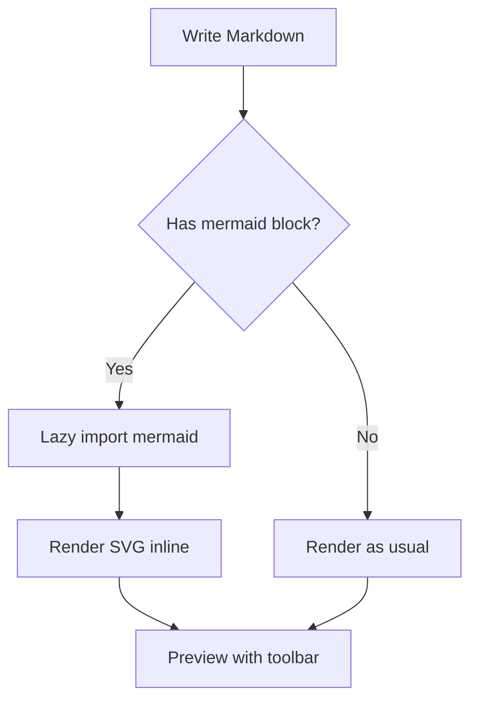

**② sequenceDiagram**

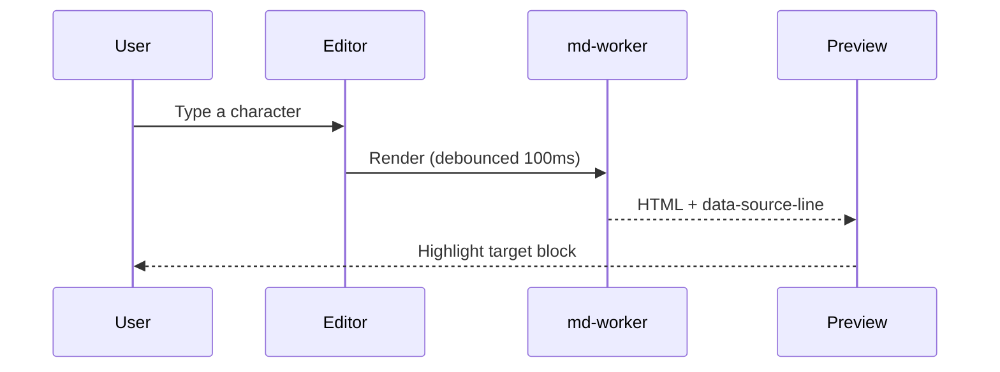

**③ classDiagram**

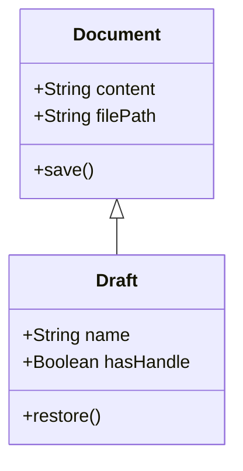

**④ stateDiagram**

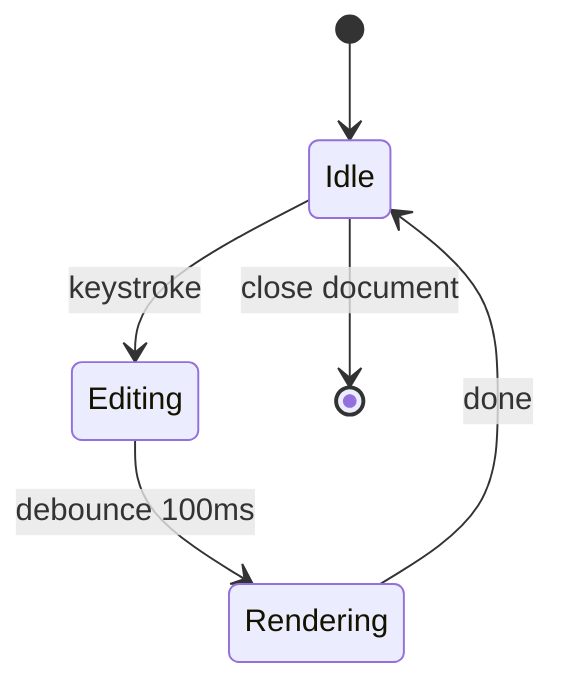

**⑤ erDiagram**

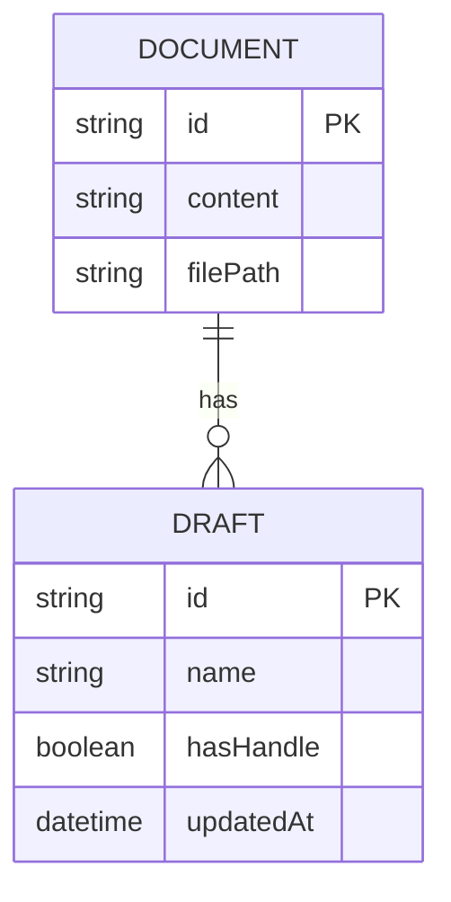

**⑥ gantt**

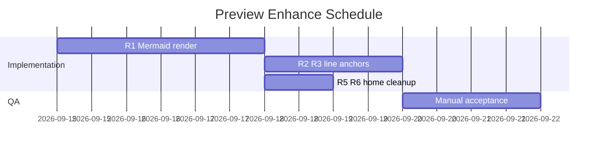

**⑦ pie**

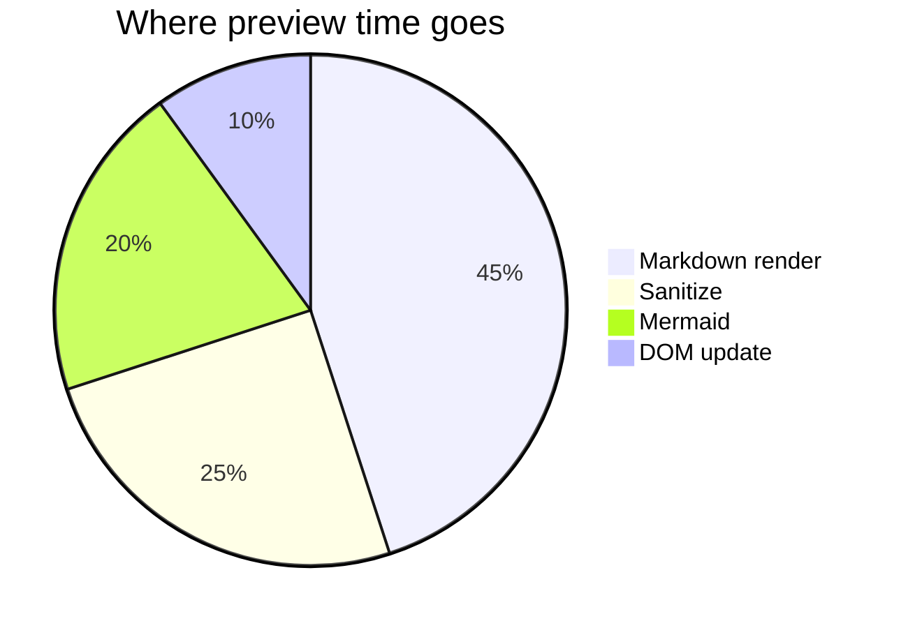

**⑧ journey**

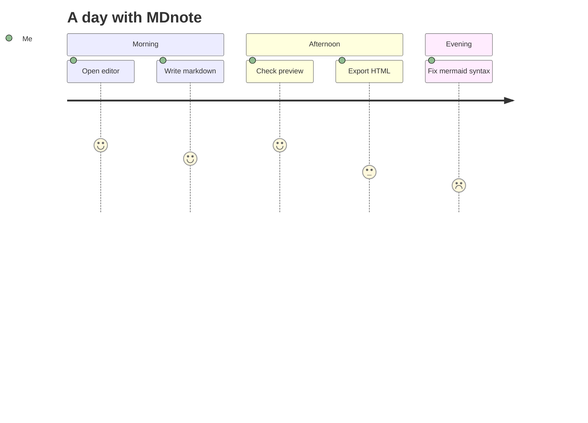

**⑨ timeline**

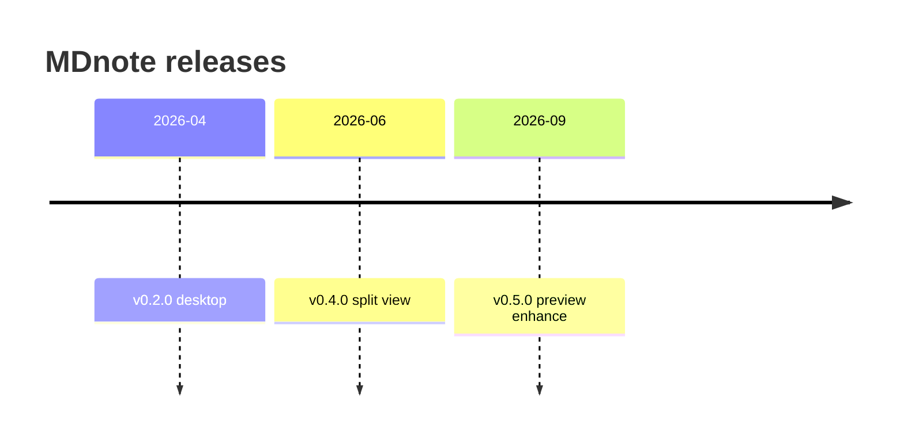

**⑩ gitGraph**

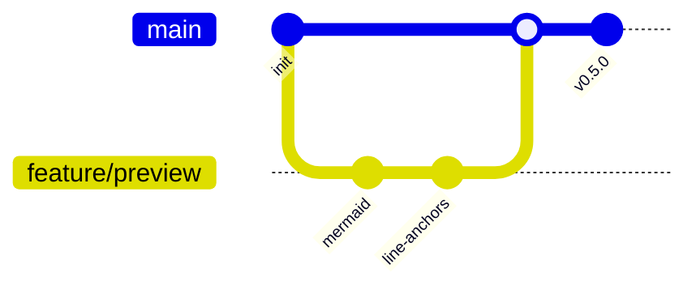

**⑪ mindmap**

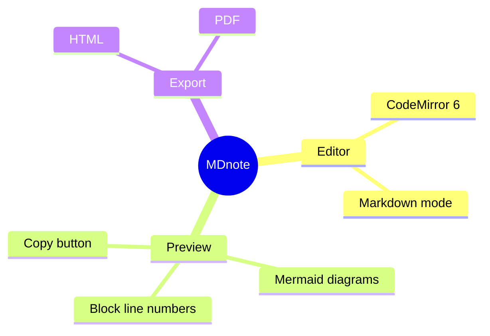

---

### §5.2 Mermaid 失败样例（A7）

**E1 语法错误**

```mermaid
flowchart TD
    A[Start] --> {Broken
    B --> C[End]
```

**E2 已裁类型（A7 抽查 2–3 个即可；若最终接受全量则 Expect 改为能渲染）**

```mermaid
architecture-beta
    group api(cloud)[API]
    service db(database)[DB] in api
    db:L -- R:api
```

```mermaid
xychart-beta
    x-axis [1, 2, 3, 4, 5]
    y-axis "Latency (ms)" 0 --> 300
    line [30, 60, 90, 120, 150]
```


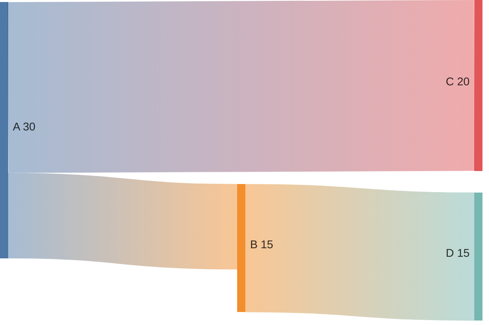

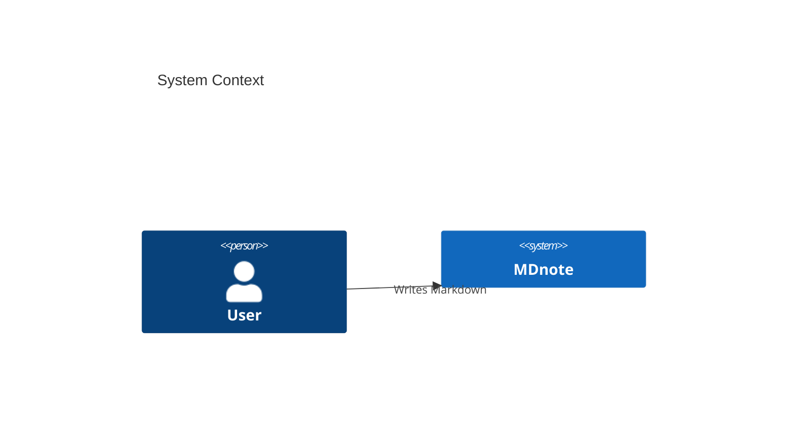

**E3 含 katex 数学公式（裁掉 katex 后应走"类型未启用/渲染失败"兜底）**

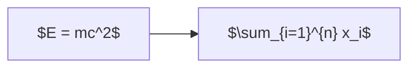

---

### §5.3 小文档样例 `sample-small.md`（A1 / A2 / A4 / A5 / A12 / A15）

> 保存为 `~/Desktop/mdnote-test/sample-small.md`。**行号对照表**（左侧数字 = 编辑器 gutter 显示，1-based）：

| 行号 | 内容 |
|---|---|
| 5 | `## Section One` |
| 20 | `Paragraph under section two — click me from the preview.` |
| 32 | `- item three of the second list` |

````markdown
# MDnote Preview Test

This is the intro paragraph used for line anchor checks.

## Section One

Paragraph one under section one, long enough to wrap onto a second visual line in a narrow preview pane.

- list item a
- list item b

```js
function hello(name) {
  return `Hello, ${name}!`;
}
```

## Section Two

Paragraph under section two — click me from the preview.

| Col A | Col B |
|---|---|
| a1 | b1 |

## Section Three

More text to push the document height beyond one screen.

- item one of the second list
- item two of the second list
- item three of the second list

## Some Heading

Anchor target section. [Jump to Some Heading](#some-heading)

> Blockquote used as an extra block anchor.

Final paragraph at the end of the document.
````

> 上面这段外层用 4 个反引号只是为了在本文档里正确嵌住内部的 `js` 代码块；**实际粘贴时只复制外层里面的内容**（含那段 `js` 围栏原样保留）。

---

### §5.4 构造「未存档草稿」的标准步骤（A16 / A17 / A18 / A21）`仅插件`

> 判定标准：草稿 `meta.hasHandle === false` 且 `meta.filePath` 为空 → 属于未存档，应被保留。

**单条构造（重复 N 次）**
1. 新开一个插件标签页（`⌘⇧M` 或点扩展图标）→ 首页
2. 点 `New Document` 进入编辑器（或直接在新标签页里输入）
3. 输入一行可识别的内容，如 `Draft-A — created 10:00`
4. **等 ≥ 5 秒**（自动保存防抖 3s，等它把草稿写进 IndexedDB；看 StatusBar 出现保存状态变化）
5. **绝对不要点 Save / ⌘S**（一点就产生 handle/path，变成非纯草稿）
6. 重复 1–5，内容依次改为 `Draft-B`、`Draft-C`……

**20+ 条批量法（A21）**：在同一个标签页里 `⌘N` → 输入 → 等 4s → `⌘N` → …… 循环 20 次（每新建文档产生一个新 draftId）。约 3–5 分钟。

**验证是否造成功**：DevTools → Application → IndexedDB → `mdnote-ext` → `drafts` → 点刷新 ↻ → 记录条数，并抽查一条的 `meta`：`hasHandle: false`、`filePath` 不存在或为空。

**回首页的方式**：新开一个插件标签页（`⌘⇧M`）。注意 `isWelcome` 只在页面首次挂载时为 true。

---

### §5.5 构造三类「非纯草稿」的标准步骤（A20）`仅插件`

| 类型 | 构造方法 |
|---|---|
| **a. `hasHandle = true`** | 先按 §5.4 造一条未存档稿 → DevTools → Application → IndexedDB → `mdnote-ext` → `drafts` → 选中该条 → 在右侧 value 里展开 `meta` → **双击 `hasHandle` 的值改成 `true`** → 回车/点别处提交 → 点面板顶部 ↻ 确认已写入。**记下该条 id** |
| **b. 带 `filePath`** | 另造一条未存档稿 → 同样方式把 `meta.filePath` 改为 `/Users/bot/Desktop/mdnote-test/B.md`（若字段不存在，改同条记录里 `meta` 下任意可编辑字段；不行则改类型 a 之外的另一条的 `filePath`）→ 提交 → **记下 id** |
| **c. 新标签页交接稿** | ① `chrome://extensions` → MDnote → 打开「允许访问文件网址」；② 关掉所有 .md 页签重开；③ 打开一个有内容的 `.md` 页面（或编辑器里打开 `A.md`）；④ 点 `Open` → 选 `B.md` → **新标签页**打开目录/文件（走 `useFileOps.ts` 的 handoff 暂存稿路径）；⑤ 立刻在 DevTools 里看 `drafts` 是否多了一条带路径信息的记录 → **记下 id** |

> 三条 id 记下来后，按 A20 的步骤 2–5 验证它们**被清理**。
> 类型 c 若因「允许访问文件网址」开关导致走的是降级路径（未开新标签页），则不会产生交接稿 —— 此时**先确认开关是开的**，否则该项无法构造（在备注里写明"未构造成功"即可，不判 Fail）。

---

### §5.6 大文档生成方法（A3 / P1 / P3 / G7）

在**终端**执行（zsh 兼容），产物落在 `~/Desktop/mdnote-test/`：

```bash
mkdir -p ~/Desktop/mdnote-test

# 250KB：阈值以下，走 B 增强档（P1 性能用，无 mermaid）
node -e 'const b="## Section Title\n\nParagraph with **bold**, *italic*, and a [link](https://example.com).\n\n- item one\n- item two\n\n";let s="";while(s.length<250*1024)s+=b;require("fs").writeFileSync(process.argv[1],s)' ~/Desktop/mdnote-test/perf-256kb.md

# 300KB：刚过 256KB 阈值，走 A 基线档（A3 用）
node -e 'const b="## Section Title\n\nParagraph with **bold**, *italic*, and a [link](https://example.com).\n\n- item one\n- item two\n\n";let s="";while(s.length<300*1024)s+=b;require("fs").writeFileSync(process.argv[1],s)' ~/Desktop/mdnote-test/large-300kb.md

# 1MB：明显超阈值（A3 / G7）
node -e 'const b="## Section Title\n\nParagraph with **bold**, *italic*, and a [link](https://example.com).\n\n- item one\n- item two\n\n";let s="";while(s.length<1024*1024)s+=b;require("fs").writeFileSync(process.argv[1],s)' ~/Desktop/mdnote-test/large-1mb.md

# 20MB：极端边界（P3 用，生成约需 10 秒）
node -e 'const b="## Section Title\n\nParagraph with **bold**, *italic*, and a [link](https://example.com).\n\n- item one\n- item two\n\n";let s="";while(s.length<20*1024*1024)s+=b;require("fs").writeFileSync(process.argv[1],s)' ~/Desktop/mdnote-test/large-20mb.md

ls -lh ~/Desktop/mdnote-test/
```

> 校验：`ls -lh` 显示的字节数应与目标一致（20MB 文件约 20M）。插件版打开 20MB 走 `Open` 选文件；桌面版走 `⌘O`。
> ⚠️ 档位按 **UTF-8 字节数**判定：上面这些命令产的是**纯 ASCII**，字节数 ≈ 字符数，可直接使用；**不要改用中文凑大小**（详见 §2.0）。若要精确核验字节数：`node -e 'console.log(new Blob([require("fs").readFileSync(process.argv[1])]).size)' <文件>`。
> `data-line-anchor` 档位确认：Elements 面板看预览内容根元素的 `data-line-anchor` 属性 = `row`（≤256KB）或 `block`（>256KB）。

---

### §5.7 超宽表格样例（A14）

```markdown
| Col A | Col B | Col C | Col D | Col E | Col F | Col G | Col H | Col I | Col J | Col K | Col L |
|---|---|---|---|---|---|---|---|---|---|---|---|
| short | short | short | short | short | short | short | short | short | short | short | short |
| a slightly longer cell value | another fairly long value here | third long value in this row | fourth value | fifth value | sixth value | seventh value | eighth value | ninth value | tenth value | eleventh value | a very very very very very long unbroken token: https://example.com/some/extremely/long/url/that/never/breaks |
| 1 | 2 | 3 | 4 | 5 | 6 | 7 | 8 | 9 | 10 | 11 | 12 |
```

窄表对照（不应出现滚动条）：

```markdown
| A | B | C |
|---|---|---|
| 1 | 2 | 3 |
```

---

### §5.8 锚点链接样例（A15）

```markdown
## Some Heading

[Jump to Some Heading](#some-heading)

（中间放 20 段以上的占位文字，让目标标题滚出视口）

## Some Heading

This is the target.
```

> 若实现用 GitHub 风格 slug：标题 `## Some Heading` → 锚点 `#some-heading`（小写、空格转 `-`）。中文标题另测一次（如 `## 中文标题` → `#中文标题` 或编码后的形式），能跳即 Pass。

---

## §6 结果记录表（验收时填写）

### 6.1 功能点测

| # | 项 | 桌面 0.5.0 | 插件 0.3.0 | 备注 / 失败现象 |
|---|---|---|---|---|
| A1 | 编辑→预览定位（小文档） | ☐ Pass ☐ Fail ☐ N/A | ☐ Pass ☐ Fail ☐ N/A | |
| A2 | 预览→编辑跳转（小文档） | ☐ Pass ☐ Fail ☐ N/A | ☐ Pass ☐ Fail ☐ N/A | |
| A3 | 大文档双向定位 | ☐ Pass ☐ Fail ☐ N/A | ☐ Pass ☐ Fail ☐ N/A | 档位：row / block |
| A4 | 独占预览 pending 跳转 | ☐ Pass ☐ Fail ☐ N/A | ☐ Pass ☐ Fail ☐ N/A | |
| A5 | 独占编辑 pending 跳转 | ☐ Pass ☐ Fail ☐ N/A | ☐ Pass ☐ Fail ☐ N/A | |
| A6 | 11 种图类型 | ☐ Pass ☐ Fail ☐ N/A | ☐ Pass ☐ Fail ☐ N/A | 记录未通过的类型 |
| A7 | Mermaid 失败兜底 | ☐ Pass ☐ Fail ☐ N/A | ☐ Pass ☐ Fail ☐ N/A | 是否为全量 mermaid |
| A8 | 主题切换重渲染 | ☐ Pass ☐ Fail ☐ N/A | ☐ Pass ☐ Fail ☐ N/A | |
| A9 | Diagram ⟷ Source 逐块独立 | ☐ Pass ☐ Fail ☐ N/A | ☐ Pass ☐ Fail ☐ N/A | |
| A10 | 导出 HTML 所见即所得 | ☐ Pass ☐ Fail ☐ N/A | ☐ Pass ☐ Fail ☐ N/A | |
| A11 | 图放大 / 下载 SVG（含 Q1） | ☐ Pass ☐ Fail ☐ N/A | ☐ Pass ☐ Fail ☐ N/A | |
| A12 | 预览行号 | ☐ Pass ☐ Fail ☐ N/A | ☐ Pass ☐ Fail ☐ N/A | |
| A13 | 代码块复制按钮 | ☐ Pass ☐ Fail ☐ N/A | ☐ Pass ☐ Fail ☐ N/A | |
| A14 | 超宽表格横向滚动 | ☐ Pass ☐ Fail ☐ N/A | ☐ Pass ☐ Fail ☐ N/A | |
| A15 | 预览内锚点跳转 | ☐ Pass ☐ Fail ☐ N/A | ☐ Pass ☐ Fail ☐ N/A | |
| A16 | 3 条未存档草稿全列出（含 Q2） | ☐ N/A | ☐ Pass ☐ Fail | 仅插件 |
| A17 | 只有三列 + 逐条按钮 | ☐ N/A | ☐ Pass ☐ Fail | |
| A18 | Restore / Discard（含 Q3） | ☐ N/A | ☐ Pass ☐ Fail | |
| A19 | 隔天仍显示 | ☐ N/A | ☐ Pass ☐ Fail | |
| A20 | 三类非纯草稿被清理 | ☐ N/A | ☐ Pass ☐ Fail | 记录被删的 id |
| A21 | 20+ 条滚动 | ☐ N/A | ☐ Pass ☐ Fail | 实际条数 |
| A22 | 首页无最近文件面板 | ☐ N/A | ☐ Pass ☐ Fail | |
| A23 | 图不重复渲染（C7） | ☐ Pass ☐ Fail ☐ N/A | ☐ Pass ☐ Fail ☐ N/A | |
| A24 | 0.2.1 升级路径 | ☐ N/A | ☐ Pass ☐ Fail | db version = |

### 6.2 性能回归

| # | 指标 | 门槛 | 旧版基线 | 桌面实测 | 插件实测 | 判定 |
|---|---|---|---|---|---|---|
| P1 | 无 mermaid 预览更新 | ≤ 基线×1.05 或 +30ms | ____ ms | ____ ms | ____ ms | ☐ Pass ☐ Fail |
| P2 | 含 mermaid 首渲 | ≤ 1000ms | — | ____ ms | ____ ms | ☐ Pass ☐ Fail |
| P2b | 无远程 mermaid 请求 | 0 个外部请求 | — | ☐ 是 ☐ 否 | ☐ 是 ☐ 否 | ☐ Pass ☐ Fail |
| P3 | 20MB 打开+首渲 | 不崩；基线 ±10% | ____ s | ____ s | ____ s | ☐ Pass ☐ Fail |
| P3b | 20MB 内存增幅 | ≤ +20%（建议） | ____ MB | ____ MB | ____ MB | ☐ Pass ☐ 记录 |
| P4 | DMG 体积 | ≤ 10MB（两个架构） | 6.7MB | arm64 ____ / x64 ____ | — | ☐ Pass ☐ Fail |

### 6.3 回归防退化

| # | 项 | 桌面 | 插件 | 备注 |
|---|---|---|---|---|
| G1 | 预览查找高亮 | ☐ Pass ☐ Fail | ☐ Pass ☐ Fail | |
| G2 | 编辑器查找替换 | ☐ Pass ☐ Fail | ☐ Pass ☐ Fail | |
| G3 | TOC 跳转 | ☐ Pass ☐ Fail | ☐ Pass ☐ Fail | |
| G4 | 导出 PDF / 打印 | ☐ Pass ☐ Fail | ☐ Pass ☐ Fail | |
| G5 | 主题切换全局一致 | ☐ Pass ☐ Fail | ☐ Pass ☐ Fail | |
| G6 | 设置持久化 | ☐ Pass ☐ Fail | ☐ Pass ☐ Fail | |
| G7 | 大文件滚动 | ☐ Pass ☐ Fail | ☐ Pass ☐ Fail | |
| G8 | 自动保存 / Save / Save As | ☐ Pass ☐ Fail | ☐ Pass ☐ Fail | |
| G9 | 快捷键与基础编辑 | ☐ Pass ☐ Fail | ☐ Pass ☐ Fail | |
| G10 | 插件 file:// 内联编辑器 | — | ☐ Pass ☐ Fail | |
| G11 | 滚动条与布局 | ☐ Pass ☐ Fail | ☐ Pass ☐ Fail | |
| G12 | Toast 层级 | ☐ Pass ☐ Fail | ☐ Pass ☐ Fail | |
| G13 | 点击归属不打架（批次 B 后） | ☐ Pass ☐ Fail | ☐ Pass ☐ Fail | |
| G14 | stopPropagation 边界（R2 侧短路） | ☐ Pass ☐ Fail | ☐ Pass ☐ Fail | |
| G15 | 拖选保护（选区不丢） | ☐ Pass ☐ Fail | ☐ Pass ☐ Fail | |
| G16 | fence 接管后代码块视觉不变 | ☐ Pass ☐ Fail | ☐ Pass ☐ Fail | |
| G17 | mermaid 容器锚点对齐（差 1 行） | ☐ Pass ☐ Fail | ☐ Pass ☐ Fail | |
| G18 | 根标记不丢失（围栏在开头） | ☐ Pass ☐ Fail | ☐ Pass ☐ Fail | |

### 6.4 签署

| 项 | 内容 |
|---|---|
| 验收人 | |
| 验收日期 | |
| 桌面版本号 / 构建时间 | |
| 插件版本号 / 构建时间 | |
| 机器与系统 | |
| Chrome 版本 | |
| 结论 | ☐ 通过　☐ 有条件通过（见 Known Issues）　☐ 打回 |
