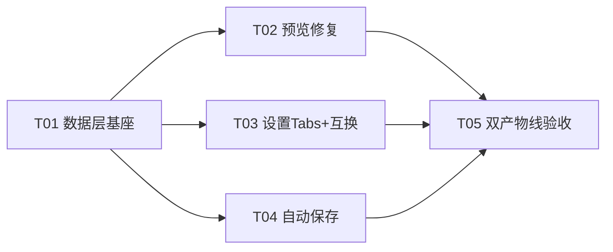

# 系统设计与任务分解 · MDnote v0.2.x 迭代

> 配套详细评审：`deliverables/architecture/arch-review-v0.2.x-iterate-2026-08-10.md`
> 评审人：高见远（Architect） · 日期：2026-08-10
> 代码基线：桌面 v0.4.1 / 插件 v0.2.0（同仓库双产物线，共享 `src/`）

**一句话结论：GO with conditions** —— 改动全在共享 `src/` 的 9 个文件 + 4 处版本号配置内，零新增依赖、零破坏性变更；但 **PRD 的 Bug 5、Bug 6 根因诊断均与实际代码不符**，放行条件是先按本文第四节（及配套 arch-review 第四节）的修正方案实施。

---

## Part A · 系统设计

### 1. 实施思路（Implementation Approach）

#### 核心技术挑战
1. **Bug 6 闪烁根因误判**：PRD 归因为 `dangerouslySetInnerHTML` 全量替换，实际根因是 `isPreviewLoading` 早返回导致整棵预览子树被卸载成 spinner。照 PRD 换 `innerHTML` 不动早返回 = 白干。
2. **Bug 5 字体不跟随根因误判**：PRD 认为 `.preview-pane` 没引用变量，实际链路完好；真正不跟随的是 `pre`/`table` 硬编码 `13.5px`（且预览区用的是等宽 SF Mono，非 PRD 所称比例字体）。
3. **双状态源**：`autoSaveEnabled`（非持久化）与 `autoSaveInterval`（持久化）各自为政，易出不一致。
4. **双产物线验收节奏**：5 项改动全在共享 `src/`，`isExtension` 只切后端不切 UI，无法按产物线隔离代码；须以「验收节奏」而非「开发节奏」切分插件/桌面两阶段。

#### 框架与库选型（沿用现有，零新增依赖）
- **React 18 + TypeScript**：UI 框架（沿用）
- **Zustand**：状态管理（沿用，`useAppStore`）
- **markdown-it + highlight.js**：在 `src/workers/md-worker.ts` Web Worker 内完成渲染与高亮（高亮已烘焙进 HTML 字符串，不依赖预览 DOM 后处理）
- **Tauri 2**：桌面后端（本轮仅 bump 配置，不改逻辑）
- **Chrome Extension MV3**：插件后端（本轮仅 bump `manifest.json`）

#### 架构模式
- 沿用 **单向数据流 + 中心化 Store**：`useAppStore`（Zustand）为唯一状态源；`App` 协调 `EditorPane`/`PreviewPane`；`useFileOps`/`useAutoSave` 为副作用 hooks。
- 预览渲染采用 **Worker 渲染 + 惰性 DOM 后处理**：HTML 字符串在 worker 产出，预览挂载后仅通过 `window` 自定义事件 + `data-source-line` 惰性查询实现 TOC/同步滚动，**无图片/链接灯箱**（PRD 的担心多余）。

### 2. 文件清单（File List）

```
src/
├── types/index.ts                 # EditorSettings 接口 + DEFAULT_EDITOR_SETTINGS（新增 splitLayout/autoSaveInterval/previewFontSize）
├── lib/constants.ts               # AUTO_SAVE_INTERVAL_OPTIONS、PREVIEW_DEBOUNCE 真正启用
├── store/useAppStore.ts           # settings 持久化、autoSaveEnabled 派生化、loadSettings 兼容
├── hooks/useFileOps.ts            # updatePreview（去 loading、去 rAF 补丁）
├── hooks/useAutoSave.ts           # interval 依赖 autoSaveInterval、inline 护栏
├── components/App.tsx             # applySettingsToCSS 增 --preview-font-size；split-reversed class
├── components/PreviewPane.tsx     # 恒定容器 + .preview-content + useLayoutEffect innerHTML + selector 订阅
├── components/SettingsDialog.tsx # 4 Tab 重构（Editor/Preview/Behavior/Auto-Save）
├── components/StatusBar.tsx       # Auto-save 文案随 interval 变化
├── components/AboutDialog.tsx     # 版本号三元分支（插件 0.3.0 / 桌面 0.5.0）
└── styles/globals.css             # .preview-pane 字号回退、pre/table→0.95em、split-reversed+分隔线换边、.preview-content/.preview-overlay
manifest.json                      # 0.2.0 → 0.3.0（插件版）
package.json                       # 0.4.1 → 0.5.0（桌面版）
src-tauri/tauri.conf.json          # 0.4.1 → 0.5.0
src-tauri/Cargo.toml               # 0.4.1 → 0.5.0
```

### 3. 数据结构与接口（Data Structures and Interfaces）

见 `docs/class-diagram.mermaid`。关键实体：
- `EditorSettings`（接口）：既有 10 字段 + 新增 `splitLayout` / `autoSaveInterval` / `previewFontSize`（及待 Q4 的 `previewFontFamily`）。
- `UseAppStore`（Zustand）：持有 `settings`/`htmlPreview`/`isPreviewLoading`/`theme`/`savedScrollTop`，提供 `loadSettings`/`updateSettings`/`resetSettings`/`setHtmlPreview`/`setIsPreviewLoading` 等。
- `App` / `PreviewPane` / `UseFileOps` / `UseAutoSave`：UI 与副作用层，均通过 store 读写。

### 4. 程序调用流程（Program Call Flow）

见 `docs/sequence-diagram.mermaid`，含两段对照：
1. **预览渲染修正前后流程** —— 直接可视化 Bug 6 真根因（`isPreviewLoading` 早返回换 DOM）与修正后（恒定容器 + `useLayoutEffect` 手动 `innerHTML` 保滚动）。
2. **自动保存频率流程** —— `autoSaveInterval` 为唯一真源，inline 模式护栏（R3）。

### 5. 待明确事项（Anything UNCLEAR）

见 Part B 第 8 节 Q1–Q8。核心阻塞项：
- **Q1** 桌面本轮是否发版（决定 4 处桌面版本号是否动、T05 桌面子阶段是否执行）
- **Q4** 预览字体族是否也独立可配（影响 `previewFontFamily` 是否入 `EditorSettings`）
- **Q5/Q6** inline 模式自动保存间隔下限与极短档取舍（影响 R3 护栏策略）

---

## Part B · 任务分解

### 6. 依赖清单（Required Packages）

本轮**零新增第三方依赖**，全部复用现有：
- `react@^18` / `react-dom@^18`
- `zustand`（状态管理）
- `markdown-it` + `highlight.js`（Worker 内渲染/高亮）
- `@tauri-apps/api` v2（桌面后端，仅 bump 配置）
- **不引入任何 UI 组件库**（遵守 PRD Non-goal）

### 7. 任务清单（有序，按依赖分组，≤5 项）

> 完整逐文件改动要点见配套 arch-review 文档。以下为符合「≤5 任务、每项 ≥3 文件」的 consolidated 视图。

| ID | 任务 | 优先级 | 依赖 | 阶段 | 改动文件（≥3） |
|----|------|:------:|------|------|----------------|
| **T01** | 数据层与状态基座：新增 `splitLayout` / `autoSaveInterval` / `previewFontSize`（及可选 `previewFontFamily`），`DEFAULT_EDITOR_SETTINGS` 同步补默认，`loadSettings` 向前兼容，`PREVIEW_DEBOUNCE` 真正启用 | P0 | — | 共享 | `types/index.ts`、`lib/constants.ts`、`store/useAppStore.ts` |
| **T02** | 预览渲染修复（Bug 5+6 修正方案）：恒定容器 + 覆盖层、去掉 `isPreviewLoading` 早返回、`useLayoutEffect` 手动 innerHTML 保滚动、selector 订阅；`updatePreview` 去 loading/rAF；`--preview-font-size` + `pre/table → 0.95em` | P0 | T01 | 共享 | `components/PreviewPane.tsx`、`hooks/useFileOps.ts`、`components/App.tsx`、`styles/globals.css` |
| **T03** | 设置弹窗 Tabs 重构 + 双屏互换：4 Tab（Editor/Preview/Behavior/Auto-Save）、`role=tablist` 无障碍、`split-reversed` class + 分隔线换边 | P1 | T01 | 共享 | `components/SettingsDialog.tsx`、`components/App.tsx`、`styles/globals.css` |
| **T04** | 自动保存频率可配：以 `autoSaveInterval` 为唯一真源派生 `autoSaveEnabled`，interval 依赖 `autoSaveInterval`，inline 模式加护栏（下限 15s 或在途跳过） | P1 | T01 | 共享 | `hooks/useAutoSave.ts`、`components/StatusBar.tsx`、`store/useAppStore.ts` |
| **T05** | 双产物线构建与真机验收：阶段 A 插件 `build:ext` + A1–A12 双模式点测 → v0.3.0；阶段 B 桌面 `tauri:build` + B1–B5 点测 → v0.5.0（受 Q1 控制） | P0/P1 | T02,T03,T04 | 插件→桌面 | `manifest.json`、`components/AboutDialog.tsx`、`package.json`、`src-tauri/tauri.conf.json`、`src-tauri/Cargo.toml` |

> 说明：本迭代无 greenfield「项目基础设施」任务，T01 承担「共享数据层基座」角色，为 T02–T04 的唯一前置，等价于 Bob 模板「第一个任务=基础设施」的语义。版本号 bump 落在 T05 的构建阶段（发布前才 bump），符合发版流程。

### 8. Shared Knowledge（跨切面约束，供工程师直接遵循）

- **存储/兼容格式**：设置读写为 `{...DEFAULT_EDITOR_SETTINGS, ...parsed}`（Zustand `persist` + `chrome.storage.local`），老配置缺字段自动取默认，**无需迁移逻辑**。
- **CSS 变量链路**：`applySettingsToCSS` 将设置写入 `document.documentElement` 内联 style（`--editor-font-size` / `--preview-font-size` 等）；`.preview-pane` 通过 `var(--x, fallback)` 消费，带 15px 回退。
- **预览后处理零 DOM 依赖**：hljs 高亮在 Worker 已烘焙进 HTML；图片路径 / sanitize 是字符串变换；TOC/同步滚动是 `window` 事件 + `data-source-line` 惰性查询；**无灯箱**。直接 `innerHTML` 赋值不丢任何后处理（仅容器 `scroll` 监听需注意节点稳定）。
- **双产物线 `isExtension` 只切后端不切 UI**：本轮 5 项改动均无平台分支；验收按「先插件后桌面」节奏，共享代码一次性实现。
- **inline 模式自动保存护栏**：`saveInlineToOriginal({silentOnly:true})` 桥接父页面，超时 15s；间隔 < 15s 会叠加在途请求，必须加护栏（R3）。
- **版本号口径**：建议 minor bump（插件 0.3.0 / 桌面 0.5.0）；桌面 4 处（package.json / tauri.conf.json / Cargo.toml / AboutDialog 三元右支），插件 2 处（manifest.json / AboutDialog 三元左支）。
- **待明确 Q1–Q8**：
  - Q1 桌面是否发版（→ T05 桌面子阶段挂起与否）
  - Q2 接受 minor（0.3.0/0.5.0）还是 patch（0.2.1/0.4.2）
  - Q3 选 OFF 时 3s 快速保存是否也停
  - Q4 预览字体族是否独立可配
  - Q5 inline 间隔下限（建议 15s）
  - Q6 是否需要 5s/10s 极短档（建议最短 10s）
  - Q7 桌面多窗口设置不同步（既存，本轮不修）
  - Q8 文件管理本轮确认不做（PRD 自相矛盾）

### 9. 任务依赖图（Task Dependency Graph）


